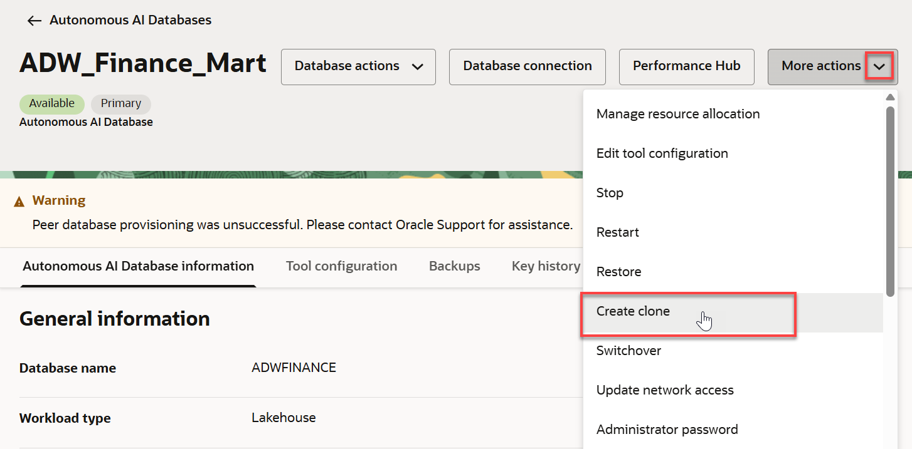
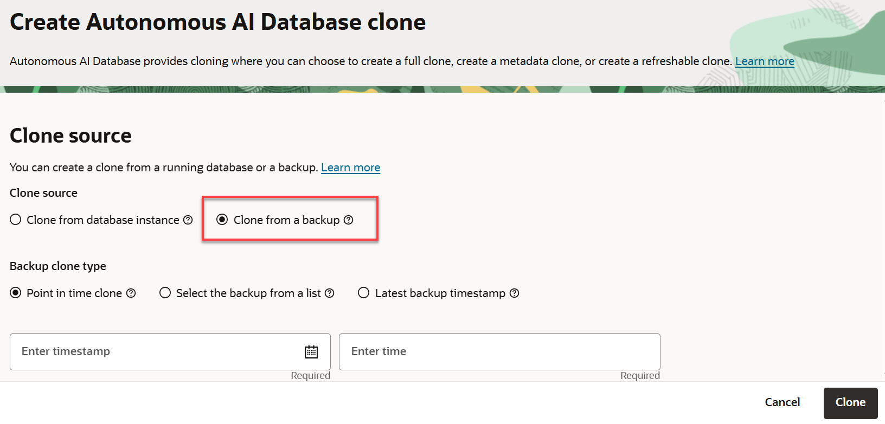
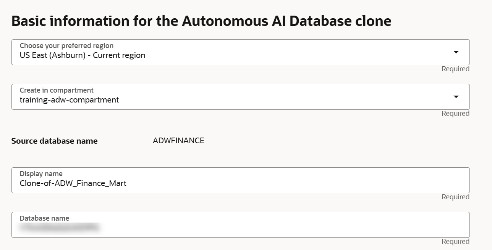

# Create a Clone Database

_**Important:** This lab uses features which are not available on Oracle's Always Free databases or on the Oracle LiveLabs Sandbox hosted environments (the Green button). If you run this lab using an Always Free database or a LiveLabs Sandbox environment, you can only review the steps and later practice the steps using your organization’s own tenancy._

## Introduction

One of the most widely used features in Autonomous AI Database Serverless is the ability to clone your database, no matter how big or small, with little to no effort.

This lab shows how to create a **full** clone from the **currently running** database or from a **backup** timestamp of that database.

In addition, you will learn how to create that clone from backup as a **cross-region** clone, if your tenancy is subscribed to multiple regions.

  

>**Note:** In the next lab, you will learn how to create a **refreshable** read-only clone that automatically refreshes when the data in its source database changes.

Estimated Lab Time: 10 minutes

Watch the video below for a quick walk-through of the lab.
[Create a Clone Database](videohub:1_ucxwam14)

### Objectives

In this lab, you will:

- Create a clone from the currently running primary database.
- Create a clone from a backup database.
- Examine how to create a clone from backup as a cross-region clone.
- Create a long-term backup.

## Task 1: Clone a Database from the Currently Running Primary Database

1. Return to the **Autonomous AI Database details** page of your source database. From the **More actions** drop-down list, select **Create clone**.

    

    The **Create Autonomous AI Database clone** page is displayed.

2. In the **Choose a clone type** section, accept the default **Full clone** selection. This creates a new database with the source database's data and metadata.

    

3. In the **Clone source** section, accept the **Clone from database instance** default selection.

    

4. In the **Basic information for the Autonomous AI Database clone** section, specify the the required information to create the clone database.
    * **Choose your preferred region:** Accept the default, which is your current region.
    * **Create in compartment:** Select a compartment to which you have access. *Important: If you are running this workshop in a LiveLabs hosted (green button) environment, select the compartment that was assigned to your reservation*.
    * **Display name:** Accept the default display name.
    * **Database name:** Accept the default database name.

        

5. For the remaining sections, use the same selections as you did in the earlier lab on provisioning an Autonomous AI Database as follows:

    * **Workload type**: `Lakehouse`.
    * **Choose database version:** `26ai`.
    * **ECPU count:** `2`.
    * **Compute auto scaling:** Enabled.
    * **Storage:** `2`.
    * **Password:** `Training4ADW`.
    * **Access type:** Secure access from everywhere.
   
        

6. Click **Clone**. The initial state of the database instance is **PROVISIONING**. Click **Skip tour**, and then click **Skip** in the **Skip guided tour** dialog box.

    >**Note**: If your tenancy subscribes to multiple regions, you can clone across regions from any of your selected database backups. When creating your cross-region clone, you can easily select the remote region to which you wish to clone from backup. You may clone a database from any available backup timestamp within the last 60 days to any region to which your tenancy is subscribed.

7. When the clone finishes provisioning, its state becomes **Available**. Review the clone information in the **Autonomous Database details** page.

    

## Task 2: Clone a Database from a Backup Timestamp of your Database

Create a full clone database from a **backup timestamp** of your currently running primary database.

1. Return to the **Autonomous Database details** page of your source database, if you are not already there. From the **More actions** drop-down list, select **Create clone**. The **Create Autonomous Database clone** dialog is displayed.

   

2. In the **Choose a clone type** section, accept the default **Full clone** selection.

    

3. In the **Clone source** section, select the **Clone from a backup** option. More selection fields appear in this section.

    

4. In the **Backup clone type** section, click **Select the backup from a list**. A list of your available backups appear. Choose one of the listed backups to create the clone.

   

    >**Note:** Backups are created daily. In this lab environment, you may not yet have as many backups listed if you recently created your Autonomous AI Database.

5. In the **Basic information for the Autonomous AI Database clone** section, specify the the required information to create the clone database.
    * **Choose your preferred region:** Accept the default, which is your current region.
    * **Create in compartment:** Select a compartment to which you have access. *Important: If you are running this workshop in a LiveLabs hosted (green button) environment, select the compartment that was assigned to your reservation*.
    * **Display name:** Accept the default display name.
    * **Database name:** Accept the default database name.

        

6. For the remaining sections, use the same selections as you did in the earlier lab on provisioning an autonomous database as follows:

    * **Workload type:** `Lakehouse`.
    * **Choose database version:** `26ai`.
    * **ECPU count:** `2`.
    * **Compute auto scaling:** Enabled.
    * **Storage:** `2`.
    * **Password:** `Training4ADW`.
    * **Access type:** `Secure access from everywhere`.
   
7. Click **Clone**. The initial state of the database instance is **PROVISIONING**. Click **Skip tour**, and then click **Skip** in the **Skip guided tour** dialog box.

    

    >**Note**: If your tenancy subscribes to multiple regions, you can clone across regions from any of your selected database backups. When creating your cross-region clone, you can easily select the remote region to which you wish to clone from backup. You may clone a database from any available backup timestamp within the last 60 days to any region to which your tenancy is subscribed.

11. When the clone finishes provisioning, its state becomes **Available**. Review the clone information in the **Autonomous Database details** page.

## Task 3: Create Long-term Backups

In today's world, regulations, audits, and compliance requirements often demand long-term retention of data. For instance, in the financial or healthcare sector, you may have to keep transactional and patient data for several years, if not decades. You may need long-term backups for compliance and regulatory requirements, legal and contractual obligations, historical analysis, or for business continuity in response to data loss.

It is essential to have a database backup plan that covers both short-term and long-term retention. As with other aspects of Oracle Autonomous AI Database, the process of long-term backups is completely automated and managed by Oracle.

> **Note:** For detailed information about creating a long-term backup, see **Lab 7: Backup and Restore Your Autonomous AI Database** in this workshop.

You may now **proceed to the next lab**.

## Want to Learn More?

* [Clone an Autonomous AI Database from a Backup](https://docs.oracle.com/en/cloud/paas/autonomous-database/adbsa/autonomous-clone-backup.html#GUID-20D2D970-0CB4-472F-BF89-1EE769BFB5E8)
* [Create a Long-Term Backup](https://docs.oracle.com/en/cloud/paas/autonomous-database/adbsa/backup-long-term.html)

## Acknowledgements

- **Author:** Lauran K. Serhal, Consulting User Assistance Developer
- **Contributor:** Nilay Panchal, ADB Product Management
- **Last Updated By/Date:** Lauran K. Serhal, October 2025
