
# Set Event and Alarm Notifications for an Autonomous Database

## Introduction

>_**Important:** The OCI Notifications service is not supported in the Livelabs hosted sandbox environment. If you are running this workshop in a LiveLabs sandbox, please view the steps in this lab to learn about setting event and alarm notifications. However, please do not attempt to perform the steps._

The Oracle Cloud Infrastructure (OCI) Notifications service broadcasts messages to distributed components through a publish-subscribe pattern, delivering secure, highly reliable, low latency and durable messages for applications hosted on OCI and externally.

The Notifications service enables you to set up communication channels for publishing messages using topics and subscriptions. When a message is published to a topic, the Notifications service sends the message to all of the topic's subscriptions.

This lab shows you how to define events and alarms with conditional rules that will generate email notifications when the state of an Autonomous Database changes or an alarm condition has been met.

**An event** is triggered for a lifecycle management (LCM) type operation performed in Oracle Cloud, such as creating a database, stopping a database, and so on.

**An alarm** is triggered over a resource utilization metric, such as a database's CPU utilization going over a certain percentage or Object Storage bucket going over a certain size limit.

Estimated Lab Time: 20 minutes

### Objectives

In this lab, you'll:

- Use the OCI Console to define a notification topic and subscribe to the topic.
- Create a rule for an Autonomous Database event that will trigger an email notification.
- Perform an activity that activates the rule and confirm that an email notification was sent.
- Create and test an Autonomous Database alarm that will trigger an email notification.

## **PART 1 - Define an Event that Will Email a Notification When a Database Is Stopped**

OCI Notifications service enables you to set up communication channels for publishing messages using topics and subscriptions.

**Topic**: A communication channel for sending messages to the subscriptions in the topic.

**Subscription**: An endpoint for a topic. Published messages are sent to each subscription for a topic.

**Message**: The content that is published to a topic. Each message is delivered at least once per subscription.

In Tasks 1 through 7, you create a notification topic with an email subscription, then create a rule that triggers a message (email) when a database is stopped.

## Task 1: Sign in to OCI Console and Create a Notification Topic

>_**Note:** Again, please note that the OCI Notifications service is not supported in the Livelabs hosted sandbox environment. If you are running this workshop in a LiveLabs sandbox, please view the steps in this lab to learn about setting event and alarm notifications. However, please do not attempt to perform the steps._

1. Create a Notification topic. Click the **Navigation** menu, and then click **Developer Services**. Under **Application Integration**, click **Notifications**.

    

2. On the **Topics** page, click **Create Topic**.

    

3. In the **Create Topic** panel, enter a name and an optional description, and then click **Create**.

    

    The new notification is displayed on the **Topics** page.

    

## Task 2: Create a Subscription to the Topic

Now that you have created a notification topic, create a subscription to that topic, so that you can receive email alerts when a condition changes. You will create a rule with conditions in a following task.

In this lab, you create an email subscription. Subscriptions can be defined to trigger emails or pager notifications (for on-call staff whose phones will be paged.)

1. On the **Topics** page, click the **Data-Notification** topic. On the **Topics details** page, click **Create Subscription**.

    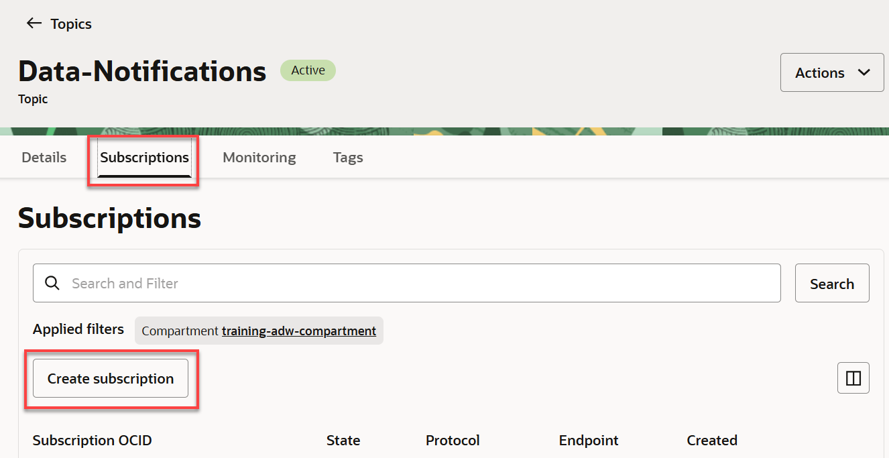

2. On the **Create Subscription** panel, specify the following:
    - **PROTOCOL:** Email
    - **EMAIL:** Enter your email address

    

3. Click **Create**. The current status of the subscription is **PENDING**.

## Task 3: Respond to the Verification Email

1. You will receive an email notification of your subscription to the email address that you specified. You need to respond to the email's verification request. Click the **Confirm subscription** link.

    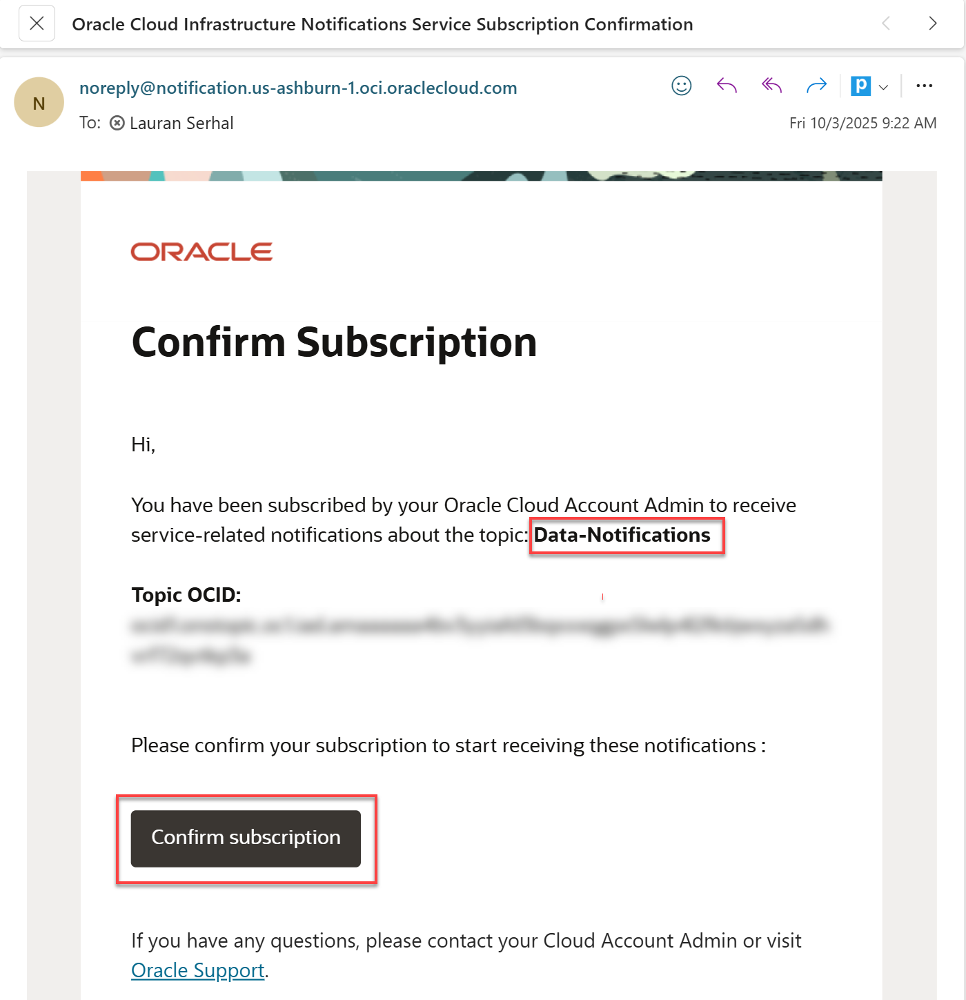

2. A browser tab opens, confirming that you have subscribed your email account to the **Data-Notification** topic.

    

3. On the **Data-Notifications** page, the new subscription is displayed. You might have to refresh the page to display the new subscription. The subscription status is now **ACTIVE**.

  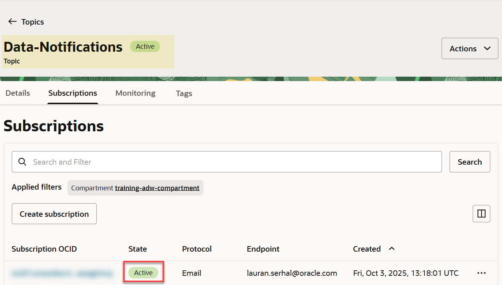

You are now subscribed to a Notification topic. Next you will define an event with conditions that, when met, will publish messages to this Notification topic.

## Task 5: Define an Event with Rules that Will Publish Messages

Let's define an event that triggers an email notification when an Autonomous Database is stopped.

1. In the Oracle Console, click the **Navigation** menu.

  

2. Click **Observability & Management**. Under **Events Service**, click **Rules**.
  
  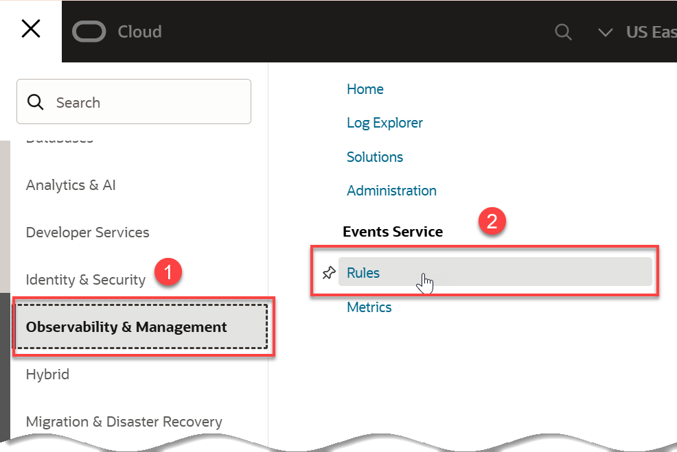

2. On the **Rules** page, click **Create Rule**.

  

3. On the **Create Rule** page, specify the following:
    - **DISPLAY NAME:** : Provide a name, such as the event type that you will be choosing; in this lab, the event type will be `Autonomous Database - Stop End`.
    - **DESCRIPTION:** Provide a description.

    In the **Rule Conditions** section, specify the following:
    - **Condition:** `Event Type`
    - **SERVICE NAME:** `Database`
    - **EVENT TYPE:** : Choose `Autonomous Database - Stop End` from the drop-down list.

    In the **Actions** section, specify the following:

    - **ACTION TYPE:** `Notifications`
    - **NOTIFICATIONS COMPARTMENT:**: Choose your compartment.
    - **TOPIC:** Choose the topic created earlier, **Data-Notification**.

4. Click **Create Rule**.

  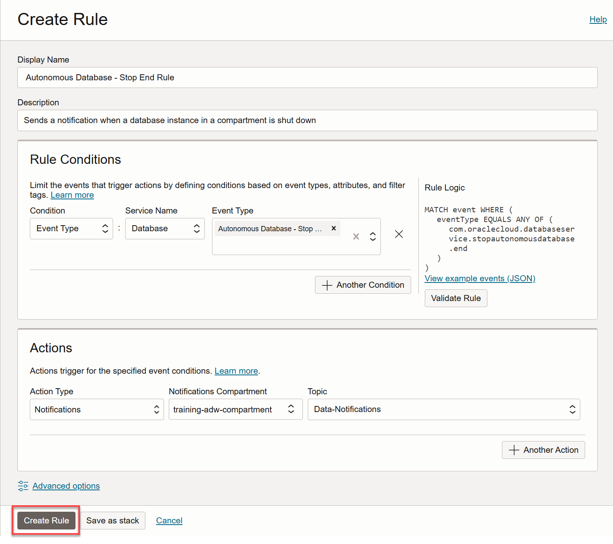

  The **Autonomous Database - Stop End** page is displayed.

  

You have configured a Notification service and tied an event to it with a specific compartment. When a database is shut down, an email notification will be sent to the email address specified.

## Task 6: Trigger the Event

You will now shut down the Autonomous Database to trigger the notification email.

1. Navigate to the **`ADW_Finance_Mart`** **Autonomous Database details** page. Click the **More actions** drop-down list, and then select **Stop**.

  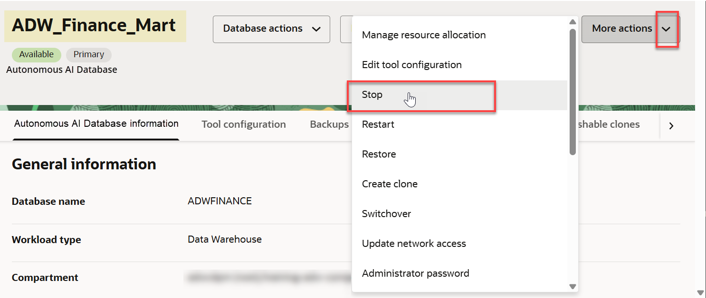

2. In the confirmation dialog box, click **Stop**.

  

3. The initial status of the database is **STOPPING**.

    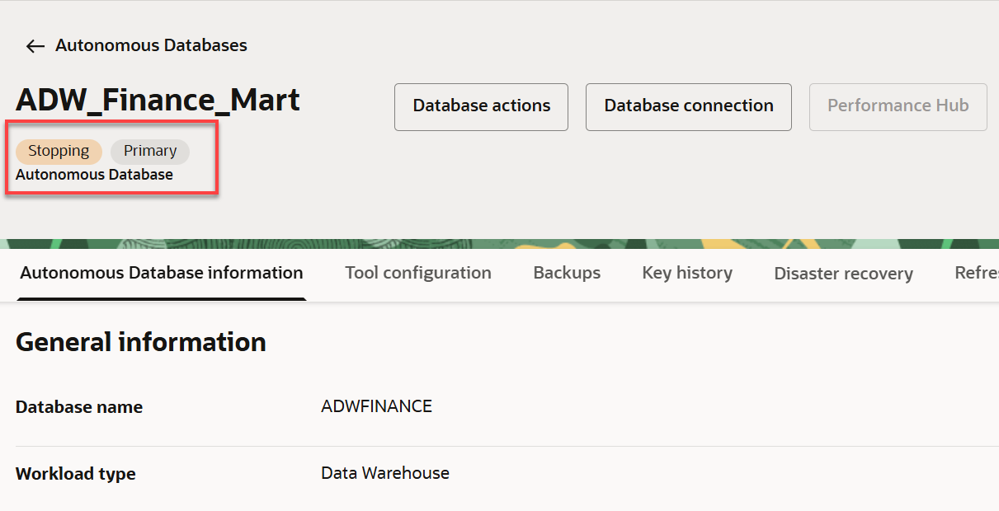

4. Wait until the database status changes to **STOPPED**.

    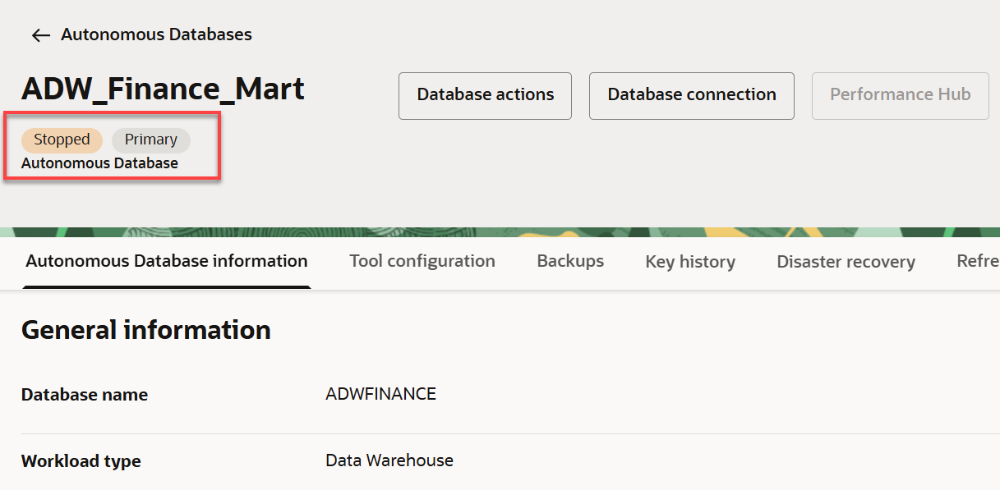

## Task 7: Verify that an Email Notification Was Sent

Check the the email account that you specified to verify that a notification email was sent.

1. Go to the specified email account and verify that a notification of the database stoppage has been sent.

  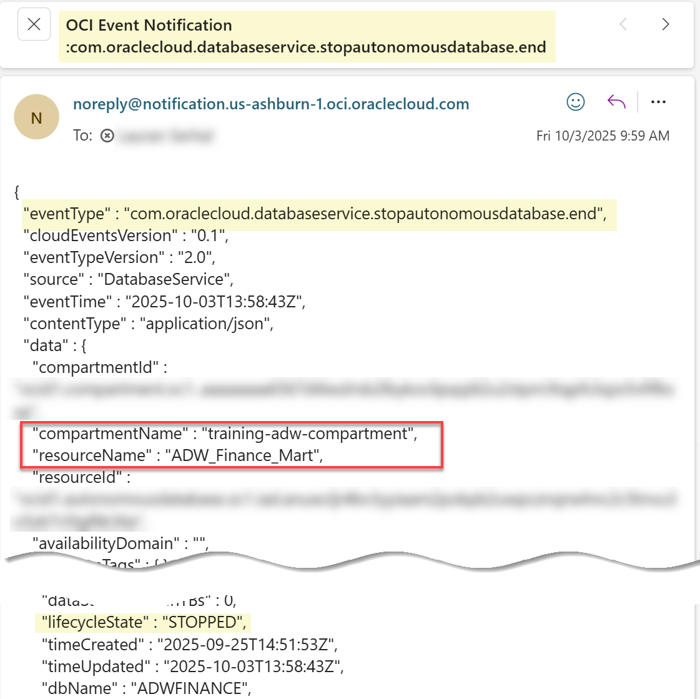

## **PART 2 - Define an Alarm that Will Email a Notification When CPU Utilization Exceeds a Specific Percentage**

In Tasks 8 through 10, define an alarm that triggers an email when CPU utilization exceeds a percentage level that you set.

>**Note:** For convenience, use the same topic and subscription that you defined in Part 1; however, you could define new ones, if you prefer.

## Task 8:  Define an Alarm for the CPU Utilization Chart

1. Start your `ADW_Finance_Mart` database. Navigate back to your `ADW_Finance_Mart` **Autonomous Database details** page, if you are not there already. Click the **More actions** drop-down list, and then select **Start**. In the **Confirm start** dialog box, click **Start**. The initial status of the workshop is **STARTING**. In a few minutes, the status changes to **AVAILABLE**.

    

2. Scroll-down the **Autonomous Database details** page to the **Metrics** charts. In the **CPU Utilization** chart, click the **Options** drop-down list, and then select **Create an alarm on this query**.

  

3. On the **Create Alarm** page, specify the following:
    - **Alarm name:** Provide a name, perhaps indicating the metric that will trigger the alarm. In this lab example, the alarm is to `alert unusual CPU usage`.
 
    In the **Metric description** section, specify the following:
    - **Compartment:** Choose the compartment that contains the Autonomous Database for which you are creating the alarm.
    - **Metric namespace**: The available options depend on the types of resources that exist in the selected compartment. In this case, choose **`oci_autonomous_database`**.
    - **Metric name** : **`CpuUtilization`**

    In the **Metric dimensions** section, specify the following:
    - Click **+Additional dimension**. Select **resourceId** from the drop-down list as the name. For the **Dimension value**, Select the first value in the drop-down list. This is the OCID for your region. You can find your region's OCID on your **Autonomous Database details** page.
    - **DeploymentType:** Select **Shared**

    In the **Trigger rule 1** section, specify the following:
    - **Operator:** `greater than`.
    - **Value:** Specify the value of the condition threshold. In this lab example, specify **30** so that the alarm will trigger if CPU utilization exceeds 30 percent.
    - **Trigger delay minutes:** Specify the number of minutes that the condition must be maintained before the alarm is in a firing state. In this lab example, specify **1** minute.
    - **Alarm severity:** Select `Critical`.

    In the **Define alarm notifications** section, specify the following:

    - **Destination service:** Select **`Notifications`**.
    - **Compartment:** Select your compartment.
    - **Topic:** Select the topic you defined earlier in **Part 1 > Task 1** of this lab, **`Data-Notifications`**.

    

4. Click **Save alarm**. The **CPU Usage Alarm** is displayed.

    

## Task 9: Create a CPU Utilization that Triggers the New Alarm

Re-run the **`test_proc`** procedure in **Lab 6: Apply Auto Scaling > Task 5** again to create a CPU utilization that triggers the alarm that you just created. You will run the `**test_proc**` procedure concurrently in 3 SQL Developer Web query worksheet instances, which should result in CPU utilization greater than the 30% specified as the triggering level in the alarm.

1. Navigate to your SQL Worksheet.

2. Go to your **Query 1**, **Query 2**, and **Query 3** SQL worksheets (re-open 3 instances if you closed the tabs from before). Change the **Consumer group** drop-down list setting to **HIGH**. Copy the following execute command into each worksheet; however, _but do not immediately execute the command_. After you have entered the command into the three worksheets, quickly click **Run Script** to execute the command in each worksheet so that they begin at nearly the same time.

    ```
    <copy>
    exec test_proc;
    </copy>
    ```
    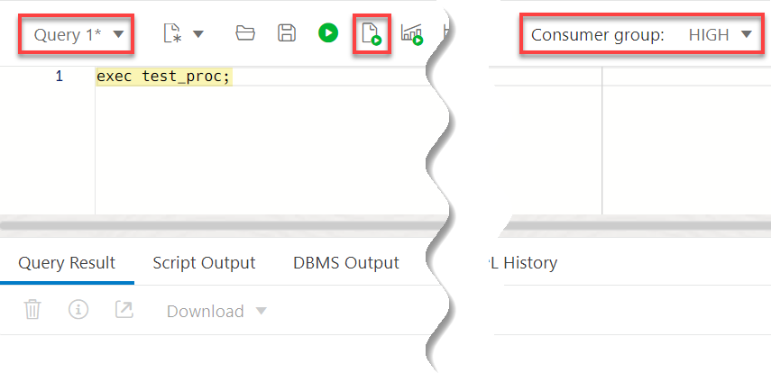

    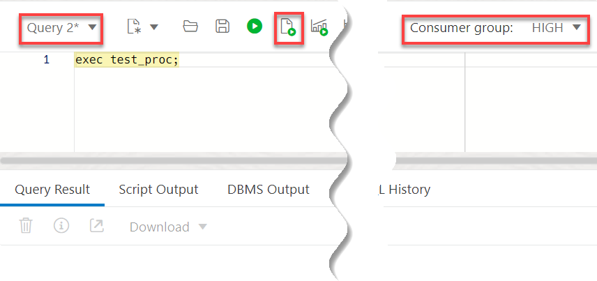

    

## Task 10: Verify that an Email Notification Was Sent

Check the email account you specified to verify that a notification email was sent.

1. Go to the specified email account and verify that a notification of the CPU utilization has been sent. 

  

You may now **proceed to the next lab**.

## Want to Learn More?

* [Getting Started with Events](https://docs.cloud.oracle.com/en-us/iaas/Content/Events/Concepts/eventsgetstarted.htm)
* [Overview of Events](https://docs.cloud.oracle.com/en-us/iaas/Content/Events/Concepts/eventsoverview.htm)
* [Notifications Overview](https://docs.oracle.com/en-us/iaas/Content/Notification/Concepts/notificationoverview.htm)

## Acknowledgements

- **Author:**
    * Lauran K. Serhal, Consulting User Assistance Developer
- **Contributors:**
    * Rick Green, Principal Developer, Database User Assistance
    * Nilay Panchal, ADB Product Management
- **Last Updated By/Date:** Lauran K. Serhal, May 2024