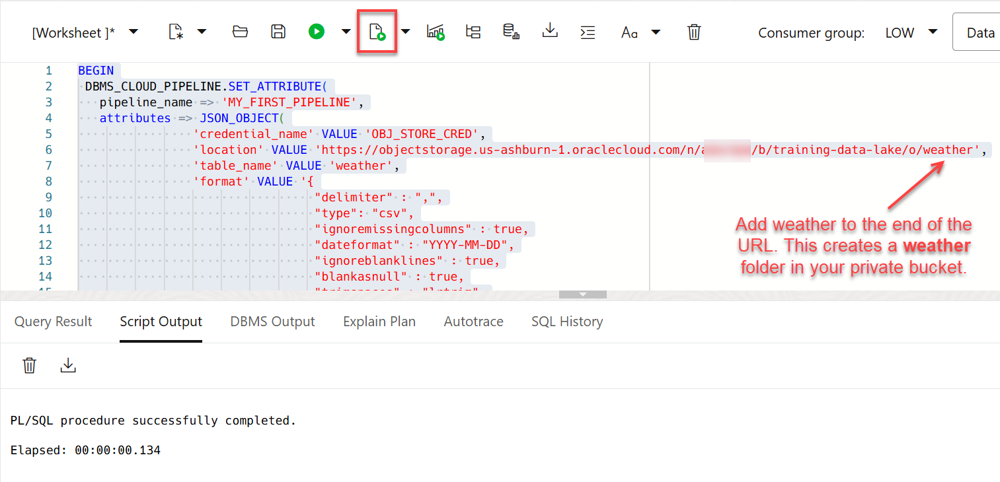
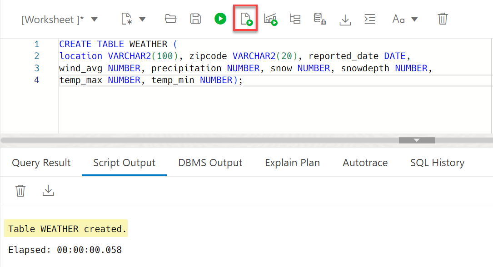
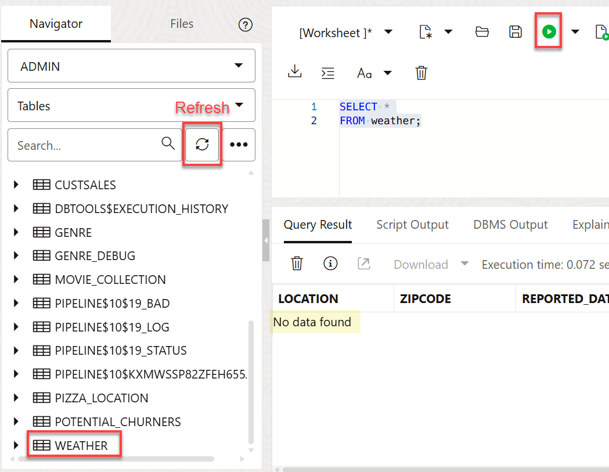
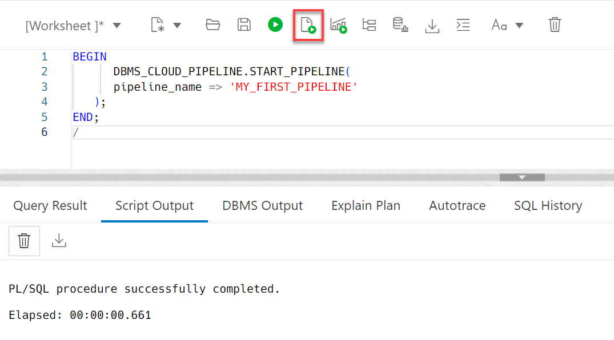

# Create Data Pipelines for Continuous Data Export and Import

## Introduction

Oracle Data Pipelines provide a continuous, incremental and fault-tolerant way to export and import data into ADB. With data pipelines, you can quickly and automatically load data into your database such as from your object store, as your ETL jobs and other data sources bring in new, clean data into your object store.

If you are loading data into or exporting out of ADB today, you are likely familiar with the **`DBMS_CLOUD`** package that provides the ability to load data into your database from the object store with `DBMS_CLOUD.COPY_DATA` or export data to your object store using `DBMS_CLOUD.EXPORT_DATA`. You may find yourself performing these operations repeatedly (you may even have scheduled jobs) to work with new data that is flowing into your object store or tables. The new Data Pipeline feature introduces the package **`DBMS_CLOUD_PIPELINE`** to simplify and automate this process, providing a unified solution of **scheduled jobs for periodic data load and export of new data files** with intuitive configurable knobs, legible troubleshooting outputs and default parallelism for optimal scalability.

The two types of data pipelines available are:

1. **Load Data Pipelines**: Data pipelines used for periodically loading data into the database, from new data files lying in your object store of choice. Some use cases for load pipelines would be:
    - Continuous migration of new on-premise data sets into the database via the object store of choice, using a load pipeline
    - Loading new, incoming real-time analytic data or outputs of an ETL process into the database using a load pipeline, via data files store in the object store

2. **Export Data Pipelines**: Data pipelines used for periodically exporting new, incremental data as results from a table or query in the database, to the object store of choice. An example use case for export pipelines would be:
    - Exporting new time-series style data generated by your application from the database to the object store at periodic intervals

Now that we understand what a data pipeline is in ADB, let's walk through how to create and set up a pipeline, to understand how it works. The steps you will follow to create and use a data pipeline are:

  1. Create a new data pipeline to either load data into the database or export data from the database.
  2. Configure your data pipeline by setting the right attributes as it relates to your data.
  3. Test that the data pipeline loads or exports some sample data as expected.
  4. Start a pipeline to continuously load or export your data.

    

Estimated Lab Time: 10 minutes

### Objectives

In this lab, you will:
* Create a data pipeline
* Configure the data pipeline attributes
* Preview how to test the data pipeline
* Preview how to reset the pipeline's state and history
* Start the data pipeline
* Upload data to your object storage bucket
* Check that the data pipeline loaded the data into the database

### Prerequisites

- This lab requires completion of the labs **Provision an Autonomous AI Database** and **Load Data from Object Storage Private Buckets** found in the Contents menu on the left.

## Task 1: Create a Data Pipeline

Begin by creating a data pipeline to either load data or export data continuously.

1. Click the **Copy** button to copy the following script into your worksheet. Run the script to create a data pipeline to load data. The **`pipeline_type`** parameter is set to **LOAD**. 

    ```
    <copy>
    BEGIN
     DBMS_CLOUD_PIPELINE.CREATE_PIPELINE(
        pipeline_name => 'MY_FIRST_PIPELINE',
        pipeline_type => 'LOAD',
        description   => 'Load weather data from object store into a table'
    );
    END;
    /
    </copy>
    ```

    

## Task 2: Configure the Data Pipeline Attributes

Next, you will set the appropriate attributes for the data pipeline, such as the type of data files (for example JSON, CSV) and the location where the data files will exist (for example an object store bucket or file folder). In this lab, the data source will be a weather CSV file that you will download and then upload to your object storage bucket. **`WEATHER`** will be the destination table that you create in your Autonomous AI Database that your pipeline will load data into.

Define the attributes for the data pipeline. The pipeline will import all data files of **CSV type** from an object storage bucket location at an interval of every 30 minutes (the default is 15 minutes) with a priority selected as High (that is, the HIGH database service name).

In preparation for step 1, in **Lab 6: Load Data from Private Object Storage Buckets**, you created a private object storage bucket and a credential to access that bucket from your Autonomous AI Database. Now you will set up continuous data loading using the object storage URL of your bucket. You will need the following:

* The **credential name** value, use the name of the credential you created in **Lab 6 > Task 6**. You named the credential `OBJ_STORE_CRED`.
*  The **location** value, which is the base URL path that you identified in **Lab 6 > Task 4**.

1. Copy and paste the following script into your SQL Worksheet. _Don't run the script yet_. Substitute the URL in the code with your own URL that you identified in **Lab 6 > Task 4**. The code below contains the `your-region` and `your-tenancy-name` place holders.

    ```
    <copy>
    BEGIN
     DBMS_CLOUD_PIPELINE.SET_ATTRIBUTE(
       pipeline_name => 'MY_FIRST_PIPELINE',
       attributes => JSON_OBJECT(
                    'credential_name' VALUE 'OBJ_STORE_CRED',
                    'location' VALUE 'https://objectstorage.your-region.oraclecloud.com/n/your-tenancy-name/b/training-data-lake/o',
                    'table_name' VALUE 'weather',
                    'format' VALUE '{
                                     "delimiter" : ",",
                                     "type": "csv",
                                     "ignoremissingcolumns" : true,
                                     "dateformat" : "YYYY-MM-DD",
                                     "ignoreblanklines" : true,
                                     "blankasnull" : true,
                                     "trimspaces" : "lrtrim",
                                     "skipheaders" : 1
                                   }',
                    'priority' VALUE 'HIGH',
                    'interval' VALUE '20')
                    );

    END;
    /
    </copy>
    ```

2.  Add **`/weather`** to the end of your URL. This creates a subfolder in your private object storage bucket named **`weather`**. This bucket will hold a weather data file that you will be uploading. Next, click the **Run Script (F5)** icon in the Worksheet toolbar.

    

## Task 3: Preview How to Test the Data Pipeline

> _**Important: The scripts in Task 3 and Task 4 of this lab are for informational purposes only. They are designed to show you how to test and reset your data pipeline, but you must NOT run them.**_

Normally, before you activate your configured pipeline, you will want to test that it works. However, to keep this lab short and simple, we will only preview the steps for testing. You would call the `DBMS_CLOUD_PIPELINE.RUN_PIPELINE_ONCE` procedure to run your pipeline once, on-demand. This would not create a repeating scheduled job.

1. Copy and paste the following script into your SQL Worksheet, and then click **Run Script (F5)** in the toolbar.

    ```
    BEGIN
    DBMS_CLOUD_PIPELINE.RUN_PIPELINE_ONCE(
            pipeline_name => 'MY_FIRST_PIPELINE'
    );
    END;
    /
    ```

2. You can monitor and troubleshoot your pipeline's running job by examining the `user_cloud_pipeline_history` view or by querying the `status_table` for each file in the pipeline via the `user_cloud_pipelines` view.

    You would then run the following query in your SQL worksheet.

    ```
    SELECT pipeline_id, pipeline_name, status, error_message  
    FROM user_cloud_pipeline_history
    WHERE pipeline_name = 'MY_FIRST_PIPELINE';
    ```
    
    

3. If something did go wrong causing your pipeline's file load to fail, you may query the database table `USER_LOAD_OPERATIONS` along with the operation IDs of your pipeline to get the related LOG and BAD files for the data load. This will provide insight into which lines in the data file cause a problem in the load.

    You would run the following query in your SQL worksheet.

    ```
    -- More details about the load operation in USER_LOAD_OPERATIONS.
    SELECT owner_name, type, status, start_time, update_time, status_table, rows_loaded, logfile_table, badfile_table
        FROM user_load_operations
        WHERE id = (SELECT operation_id
                   FROM user_cloud_pipelines
                   WHERE pipeline_name = 'MY_FIRST_PIPELINE');
    ```

    ```
    --Query the relevant LOG and BAD files
    SELECT * FROM PIPELINE$4$21_LOG;
    SELECT * FROM PIPELINE$4$21_BAD;
    ```

## Task 4: Preview How to Reset the Pipeline's State and History

> _**Important: The scripts in Task 3 and Task 4 of this lab are for informational purposes only. They are designed to show you how to test and reset your data pipeline, but you must NOT run them.**_

Before proceeding to Start your pipeline, if you had tested your pipeline as was shown in Task 3, you would then use the `DBMS_CLOUD_PIPELINE.RESET_PIPELINE` procedure to reset the pipeline's state and history of loaded files. As below, you may also optionally purge the data in your database or object store. A data pipeline must be in stopped state to reset it.

1. To reset your pipeline, you would run the following script in your SQL worksheet:

    ```
    BEGIN  
    DBMS_CLOUD_PIPELINE.RESET_PIPELINE(
         pipeline_name => 'MY_FIRST_PIPELINE',
         purge_data => TRUE
    );
    END;
    /
    ```

## Task 5: Create the WEATHER Table in the Target Autonomous AI Database

Before starting the data pipeline, create the **`WEATHER`** table in your target Autonomous AI Database that the data pipeline will load, when it detects data that you upload to your object store.

1. Create the **`WEATHER`** table. Copy and paste the following code into your SQL Worksheet, and then click **Run Script (F5)** in the toolbar.

    ```
    <copy>
    CREATE TABLE WEATHER (location VARCHAR2(100), zipcode VARCHAR2(20), reported_date DATE, wind_avg NUMBER, precipitation NUMBER, snow NUMBER, snowdepth NUMBER, temp_max NUMBER, temp_min NUMBER);
    </copy>
    ```

    

2. Let's query the newly created **`WEATHER`** table. Copy and paste the following query  into your SQL Worksheet, and then click **Run Statement** in the toolbar.

     ```
    <copy>
    SELECT *
    FROM weather;
    </copy>
    ```

    

    The newly created table is empty, as expected.

    >**Note:** If your **`WEATHER`** table is not displayed in the **Navigator** pane, click the **Refresh** icon.


## Task 6: Start the Data Pipeline

Now that your data pipeline is successfully configured, and you have created the target **`WEATHER`** table in your Autonomous AI Database, all you have left to do is simply start the pipeline.

Once your start your pipeline, it will run and since it is a **load data** pipeline, it will pick up new data files to load that have not been successfully processed yet, as they are moved into your object storage bucket.

It is important to note here that the load pipeline identifies, loads, and keeps track of new data files by their filename; updating or deleting data from an existing filename that had already been loaded successfully in the past will not affect data in the database. The pipeline will also retry loading a previously failed file several times.

1. Start the pipeline. Copy and paste the following script into your SQL Worksheet, and then click **Run Script (F5)** in the toolbar.

    ```
    <copy>
    BEGIN
          DBMS_CLOUD_PIPELINE.START_PIPELINE(
          pipeline_name => 'MY_FIRST_PIPELINE'
       );
    END;
    /
    </copy>
    ```

    

## Task 7: Download Data that you Will Upload to Object Storage

For this example, download a .CSV file that contains the weather information. In the next task, you will upload this weather data to your object storage bucket and test whether the pipeline automatically adds the data to your **`WEATHER`** table.

1. Copy and paste the following URL to your browser and then press the **[Enter]** key on your keyboard. The file is usually downloaded to the **`Downloads`** folder on a MS-Windows computer. 

    ```
    <copy>
    https://objectstorage.us-ashburn-1.oraclecloud.com/n/c4u04/b/moviestream_landing/o/weather/weather-newark-airport.csv
    </copy>
    ```

2. Make a note of the downloaded file location. You will be using this file in the next task.

## Task 8: Upload the Data to your OCI Object Storage Bucket

In this task, you will upload the downloaded **`weather-newark-airport.csv`** file to your private object storage bucket. The pipeline should detect this new data, and automatically load it into your Autonomous AI Database.

1. In the **Autonomous AI Database** browser tab, open the **Navigation** menu in the Oracle Cloud Console and click **Storage**. Under **Object Storage & Archive Storage**, click **Buckets**.

2. On the **Buckets** page, select your compartment that contains your bucket from the **Compartment** field, if needed. In this example, we chose our own compartment named **`training-adw-compartment`**. Make sure you are in the region where you created your bucket.

    <!-- Redwood UI Bucket, when ready 
    
    -->

3. Click your **bucket name** to open it. The **Bucket details** page is displayed. Click the **Objects** tab. The `potential_churners.csv` file that you uploaded in a previous lab is displayed.

    

4. Create a new folder in this bucket to where you'll upload the weather data. Click the **Actions** drop-down list, and then select **Create new folder**.

    

5. In the **Create new folder** dialog box, enter **`weather`** as the name of the folder, and then click **Create folder**.

    

6. Click the **Actions** icon (ellipsis) associated with the **`weather`** folder, and then select **Upload objects** from the context menu.

    

7. On the **Upload objects** dialog box, scroll down to the **Choose Files from your Computer** section, and then click the **Drop a file or select one** box.

    

8. Navigate to the location where you downloaded the **`weather-newark-airport.csv`** file, and select it. The file name is displayed in the **File upload** dialog box. Click **Next**. 

    

9. On the **Review and upload files** page, click **Upload objects**.

    

10. When uploading the file is completed, the status is **Done**. Click **Close**.

    

11. The **Bucket details** page is re-displayed. Click the **weather** folder.

    

    The **`weather-newark-airport.csv`** file is displayed under the **weather** folder.

    

## Task 9: Check that the Data Pipeline Loaded the Data into the Database

When you uploaded your new weather data to your object store, the pipeline should have detected the new data and loaded it to your target Autonomous AI Database **`WEATHER`** table.

1. Check that your weather data was loaded from your object store to the **`WEATHER`** table in your database. Copy and paste the following query into your SQL Worksheet, and then click the **Run Scripts** icon. The query shows a sampling of 10 rows of data from the **`WEATHER`** table:

    ```
    <copy>
    SELECT * 
    FROM WEATHER
    WHERE ROWNUM <=10;
    </copy>
    ```

    

## Learn More

* [Use Data Pipelines for Continuous Load and Export](https://docs.oracle.com/en/cloud/paas/autonomous-database/serverless/adbsb/autonomous-pipelines.html#GUID-7A23F17E-DADD-4F49-9967-BD2FA581CED7)

## Acknowledgements

* **Author:** Lauran K. Serhal, Consulting User Assistance Developer

* **Contributors:** 

    * Nilay Panchal, Principal Product Manager, Autonomous AI Database
    * Sanket Jain, Architect, Autonomous AI Database
   
* **Last Updated By/Date:** Lauran K. Serhal, October 2025

Data about movies in this workshop were sourced from Wikipedia.

Copyright (C) 2025 Oracle Corporation.

Permission is granted to copy, distribute and/or modify this document
under the terms of the GNU Free Documentation License, Version 1.3
or any later version published by the Free Software Foundation;
with no Invariant Sections, no Front-Cover Texts, and no Back-Cover Texts.
A copy of the license is included in the section entitled [GNU Free Documentation License](https://oracle-livelabs.github.io/adb/shared/adb-15-minutes/introduction/files/gnu-free-documentation-license.txt)
