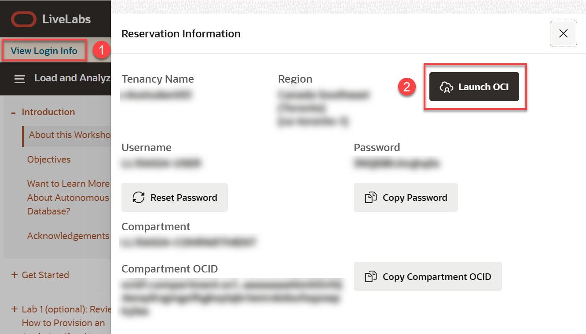
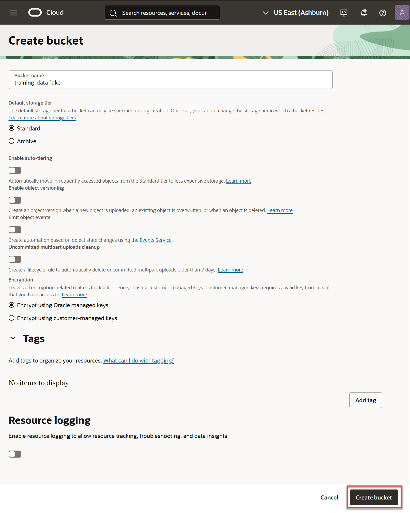
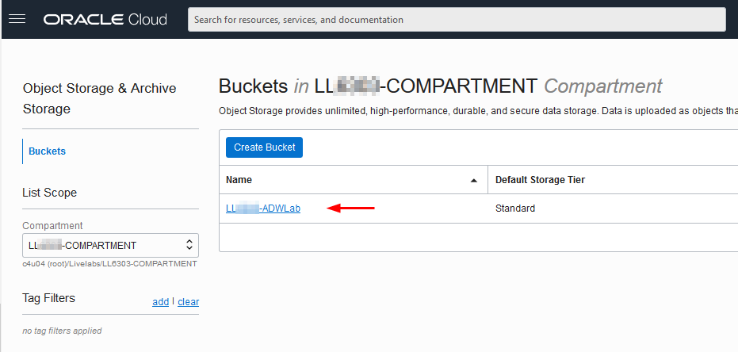
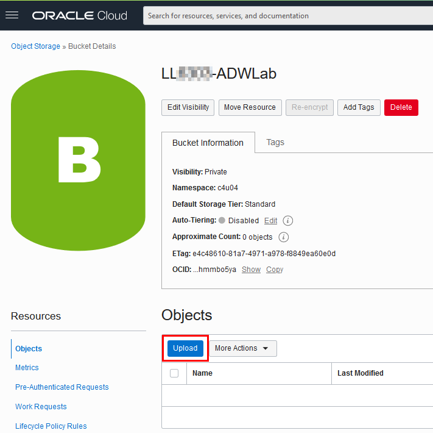
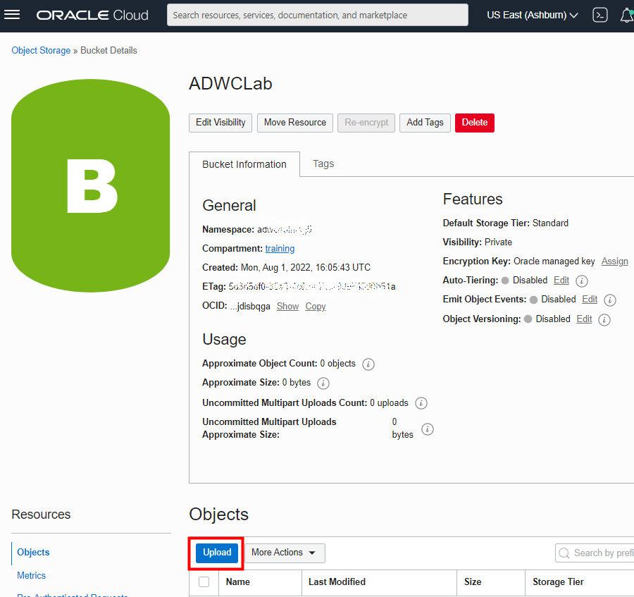

# Load Data from Private Object Storage Buckets

## Introduction
In this lab, you will load more data from the MovieStream data lake on [Oracle Cloud Infrastructure Object Storage](https://www.oracle.com/cloud/storage/object-storage.html) into your Oracle Autonomous AI Database instance, in preparation for exploration and analysis.

In the course of this workshop, we are exploring six methods for loading data into an Oracle Autonomous AI Database. In the previous data loading labs, you loaded data from a file on your local PC and from a **public** object storage bucket. In this 3rd data loading lab, you practice loading data from a **private** object storage bucket. You learn how to set up and use an authentication token and object store credentials to access sensitive data in the private object store. Instead of using the wizard-driven data loading tools of Database Actions, you practice loading data using the DBMS_CLOUD PL/SQL package, the preferred method for load automation.

> **Note:** While this lab uses Oracle Autonomous Database Lakehouse workload type, the steps are identical for loading data into an Oracle AI Autonomous Transaction Processing database.

Estimated Time: 20 minutes

### Objectives

In this lab, you will:
- Download to your local computer a comma-separated value (CSV) file containing a simulation of sensitive customer data
- Create a private OCI Object Storage bucket
- Upload the CSV file to the OCI bucket
- Create an object store auth token
- Define object store credentials for your Autonomous AI Database to communicate with the bucket
- Load data from the object store using the DBMS_CLOUD PL/SQL package
- Troubleshoot the data load

### Prerequisites

- This lab requires completion of the lab, **Provision an Autonomous AI Database** from the **Contents** menu on the left.

## Task 1: Download Customer Data from a Public Bucket

First, download a **`CSV`** file containing a simulation of sensitive customer retention data. Later, you will stage the file to a private **OCI Object Storage** bucket, to populate a table in later tasks.

1. Copy and paste the following URL into a _**new tab**_ in your web browser, and then press **[ENTER]**. The **moviestream\_sandbox** Oracle Object Storage bucket that contains the data is located in a different tenancy than yours, **c4u04**.

    ```
    <copy>
    https://objectstorage.us-ashburn-1.oraclecloud.com/n/c4u04/b/moviestream_sandbox/o/potential_churners/potential_churners.csv
    </copy>
    ```

2. The browser page downloads (the **Downloads** directory by default in MS-Windows) and displays the **`potential_churners.csv`** file which contains customers who will stop or might stop being repeat customers. The data in the downloaded file is also displayed in an Excel worksheet. Close the worksheet.

  

    >**Note:** Make a note of where you downloaded the file. You will upload it to the private object storage bucket that you will create in the next task.

## Task 2: Create a Private Object Storage Bucket

Create a private Object Storage bucket to store your data. For more information about Oracle Object Storage, see [Explore more about Object Storage in Oracle Cloud.](https://docs.oracle.com/en-us/iaas/Content/Object/home.htm)

<if type="livelabs">

1. Navigate back to the Oracle Cloud Console. In your **Run Workshop** browser tab, click the **View Login Info** tab. In your **Reservation Information** panel, click **Launch OCI**.

    

2. Open the **Navigation** menu in the Oracle Cloud console and click **Storage**. Under **Object Storage & Archive Storage**, click **Buckets**.

3. On the **Buckets** page, select the compartment that was assigned to you where you want to create the bucket from the **Compartment** drop-down list in the **Applied filters** section. Make sure you are in the region that was assigned to you where you will create your bucket.

4. Click **Create Bucket**.

5. In the **Create Bucket** panel, specify the following:
    - **Bucket Name:** Enter a meaningful name for the bucket.
    - **Default Storage Tier:** Accept the default **Standard** storage tier. Use this tier for storing frequently accessed data that requires fast and immediate access. For infrequent access, choose the **Archive** storage tier.
    - **Encryption:** Accept the default **Encrypt using Oracle managed keys**.

    >**Note:** Bucket names must be unique per tenancy and region.

6. Click **Create** to create the bucket.

  

7. The new bucket is displayed on the **Buckets** page. The default bucket type (visibility) is **Private**.

  
</if>

<if type="freetier">

1. In the **Autonomous AI Database** browser tab, open the **Navigation** menu in the Oracle Cloud console and click **Storage**. Under **Object Storage & Archive Storage**, click **Buckets**.

    

2. On the **Buckets** page, select the compartment where you want to create the bucket from the **Compartment** drop-down list in the **Apply filters** section. In this example, we chose a compartment named **`training-adw-compartment`**. Make sure you are in the region where you want to create your bucket.

    

3. Click **Create bucket**.

4. In the **Create bucket** panel, specify the following:
    - **Bucket name:** Enter a meaningful name for the bucket. In this example, we chose **`training-data-lake`** as the name.
    - **Default storage tier:** Accept the default **Standard** storage tier. Use this tier for storing frequently accessed data that requires fast and immediate access. For infrequent access, choose the **Archive** storage tier.
    - **Encryption:** Accept the default **Encrypt using Oracle managed keys**.

    >**Note:** Bucket names must be unique per tenancy and region; otherwise an **already exists** error message is displayed.

5. Click **Create bucket** to create the bucket.

  

6. The new bucket is displayed on the **Buckets** page. The default bucket type (visibility) is **Private**.

  

  </if>

## Task 3: Upload Customer Data to your Private Object Storage Bucket

Upload the **`potential_churners.csv`** file that you downloaded earlier in this lab to your newly created private Object Storage bucket. Normally, you would likely upload multiple files to an OCI Object Storage bucket; However, to keep this lab simple and quick, you will upload one file.

1. On the **Buckets** page, click the new bucket name link. 

2. On the **Bucket Details** page, click **Upload objects**.

  

3. In the **Upload objects** panel, you can drag and drop a single or multiple files into the **Choose Files from your Computer** field or click **select files** to choose the file(s) that you want to upload from your computer. In this example, we used the drag-and-drop method to select the **`potential_churners.csv`** file from our **Downloads** folder.

  

4. Click **Next**. The **Review and upload files** panel is displayed.

  

5. Click **Upload objects** to upload the selected file to the bucket.

6. When the file is uploaded successfully, a **Done** status is displayed. 

    

7. Click **Close** to close the **Upload objects** panel. The **Bucket details** page is re-displayed. 

    

8. Click the **Objects** tab. The newly uploaded file is displayed in the **Objects** section.

    

<!---
Note to self. I need to update and include the conditional if for livelabs when I am done updating and testing the freetier

<if type="livelabs">
    

2. Click the **Upload** button:

    
</if>
<if type="freetier">
    

2. Click the **Upload** button:

    
</if>
-->

## Task 4: Locate the Base URL for the Object Storage File

Find the base URL of the object you just uploaded to your private Object Storage bucket.

1. In the **Objects** section, in the row for the **`potential_churners.csv`** file, click **Actions** icon (the 3-dot ellipsis), and then select **View object details** from the context menu.

    

2. In the **Object details** panel, copy the **URL Path (URI)** that points to the location of the file in your private Object Storage bucket up to the **`/o`** part. **_Do not include the trailing slash;otherwise, you will get an error message when you use the URL_**. Save the base URL in a text editor of your choice such as Notepad in MS-Windows. You will use this URL in the upcoming tasks. Next, click **Cancel** to close the **Object details** page.

    

3. The format of the URL is as follows:

    `https://objectstorage.<`**region name**`>.oraclecloud.com/n/<`**namespace name**`>/b/<`**bucket name**`>/o`

    In our example, the **region name** is `us-ashburn-1`, the **Namespace** is blurred for security, and the **bucket name** is `training-data-lake`.

    

## Task 5: Create an Object storage Auth Token

To load data from the Oracle Cloud Infrastructure (OCI) Object Storage, you will need an OCI user with the appropriate privileges to read data (or upload) data to the Object Storage bucket. The communication between the database and object storage relies on the native URI, and the OCI user's Auth Token.

1. In the Console banner, click the **Profile** icon. The **Profile** drop-down menu is displayed. Select **User settings**.

    

<!-- 
    >**Note:** Make a note of your OCI user's name that is displayed in the **Profile** drop-down menu as you will need it in a later task. This username might have a prefix followed by an email address, for example:    
    **`oracleidentitycloudservice/xxxxxxx.xxxxx@xxxxxx.com`**
Removed since I am using the default domain. -->

2. On the **User Profile** page, click the **Tokens and keys** tab. 

    

3. Scroll down the page to the **Auth tokens** section, and then **Generate token**.

    

3. In the **Generate token** panel, enter a meaningful description for the token, and then click **Generate token**.

    

4. The new Auth token is displayed. Click the ellipsis icon, and then click **Copy** from the context menu to copy the Auth Token to the clipboard. Save the contents of the clipboard in a text editor file of your choice. You will use it in the next tasks.

    >**Note:** You can't retrieve the Auth Token again after you close the panel.

    

5. Click **Close** to close the **Generate token** panel. The **User Profile** page is re-displayed. The new Auth token is displayed.

    

## Task 6: Define a Cloud Location and Create a Credential Using the DATA LOAD Tool

You will load data from the `potential_churners.csv` file you uploaded to your private Oracle Object Store, using the DBMS_CLOUD PL/SQL package. There are two parts to this process and you must perform the first part only once. The two parts are:

+ Set up connection to the Oracle Object Store by defining a cloud location with credential.
+ Load the file using the DBMS_CLOUD PL/SQL package.

First, define a new **Cloud Location** to connect to the Oracle Object Storage bucket. To begin this process, you need to navigate back to the **DATA LOAD** page under **Database Actions**.

[](include:adb-goto-data-load-utility.md)

3. In the **Data Load** main page, click the **Connections** card.

    

4. On the **Connections** page, click the **Create** drop-down list, and then select **New Cloud Store Location**.

    

5. Specify the following in the **Add Cloud Store Location** panel.
    + **Name:** Enter **`oci-cloud`**.
    + **Description:** Enter an optional description.
    + Accept the default **Select Credential** option. To access data in the Object Store, you need to enable your database user to authenticate itself with the Object Store using your OCI object store account and a credential. You do this by creating a private CREDENTIAL object for your user that stores this information encrypted in your Autonomous Data Warehouse. This information is only usable for your user schema.
    + Click **Create Credential**.
    + In the **Create Credential** dialog box, specify the following:
        + **Credential Name:** Enter **`OBJ_STORE_CRED`**. **Note:** The credential name must conform to Oracle object naming conventions, which do not allow spaces or hyphens.
        + **Cloud Service:** Select **Oracle** from the drop-down list since you will load data from your Oracle Object Storage bucket.
        + **OCI Create Credential Method:** Select the **Cloud Username and Password** option.
        + **Oracle Cloud Infrastructure Username:** Specify your Oracle Cloud Infrastructure user name that you identified in **Task 5**.
        + **Auth Token:** Copy and paste the Auth Token that you generated in **Task 5** and that you saved to a text file.

6. Click **Create Credential**.

    

    The **Add Cloud Store Location** panel is re-displayed. The newly created **`OBJ_STORE_CRED`** credential is displayed in the **Select Credential** drop-down list.

    

7. Specify the following in the **Add Cloud Store Location** panel:    
    + **Bucket URI option:** Select this option, if it's not already selected.    
    + **Bucket URI field:** Enter the Bucket URI that you recorded in **Task 4**. Remember to use the following general structure while substituting the `region-name` and `namespace-name` place holders with your own values.

        ```
        https://objectstorage.region-name.oraclecloud.com/n/namespace-name/b/bucket name/o
        ```

        

8. Click **Next** to see the available objects in the bucket that you specified. The **Cloud Data** wizard step is displayed. Our bucket contains the `potential_churners.csv` file that we uploaded earlier.

    

9. Click **Create**. The **`oci-cloud`** cloud location connection is displayed in the **Connections** page.

    

## Task 7: Load Data from the Private Object Storage Bucket Using the DBMS_CLOUD PL/SQL Package

As an alternative to the wizard-guided data load that you used in the previous labs, you can use the PL/SQL package `DBMS_CLOUD` directly. This is the preferred choice for any load automation.

The `DBMS_CLOUD` package supports loading data files from the following Cloud sources: Oracle Cloud Infrastructure Object Storage, Oracle Cloud Infrastructure Object Storage Classic, Amazon AWS S3, Microsoft Azure Cloud Storage, and Google Cloud Storage.

This task shows how to load data from Oracle Cloud Infrastructure Object Storage using two of the procedures in the `DBMS_CLOUD` package:

+ **`create_credential`**: Stores the object store credentials in your Autonomous Data Warehouse schema.
    + You will use this procedure to create object store credentials in your ADW `admin` schema.
+ **`copy_data`**: Loads the specified source file to a table. The table must already exist in ADW.
    + You will use this procedure to load tables to your `admin` schema with data from data files staged in the Oracle Cloud Infrastructure Object Storage cloud service.

1. Now that you've created the Cloud Location to connect to the Oracle Object Store, you're ready to load the `potential_churners.csv` file from your bucket. Navigate back to the main **Database Actions Launchpad**. Click **Database Actions** in the banner to go to the Launchpad.

    

    >**Note:** If you are prompted for username and password, enter the username `admin` and the password you created for `admin` when you created your Autonomous AI Database.

2. On the Launchpad, click the **Development** tab, and then click the **SQL** tab to open SQL Worksheet.

    

3. Unlike the earlier tasks where the Database Actions Data Load tool gave you the option to automatically create the target Oracle Autonomous AI Database tables during the data load process, the following steps for loading with the `DBMS_CLOUD` package require you to first create the target tables.

    Connected as your `ADMIN` user in SQL Worksheet, copy and paste the following script to the worksheet. This creates the required `potential_churners` table. Take a moment to examine the script. You will first drop any table with the same name before creating the table. Click the **Run Script** icon in the toolbar to run it.

    ```
    <copy>
    DROP TABLE potential_churners;
    CREATE TABLE potential_churners (
    cust_id                 NUMBER NOT NULL,
    will_churn              VARCHAR2(200),
    prob_churn              VARCHAR2(200)
    );
    </copy>
    ```

    > **Note:** Expect to receive *ORA-00942 table or view does not exist* errors during the `DROP TABLE` command for the first execution of the script, but you should not see any other errors.

    

    > **Note:** You do not need to specify anything other than the list of columns when creating tables in the SQL scripts. You can use primary keys and foreign keys if you want, but they are not required.

4. Copy the following code and paste it in your SQL Worksheet. This code copies the data in the `potential_churners.csv` file you uploaded to the object storage bucket, to the target `potential_churners` table you just created in your Autonomous AI Database.
Replace the provided example URL with the real object storage base URL that you identified and copied in **Task 4**. In the **define** statement in the code example, substitute the _your-region-name_, _your-tenancy-name_, and _your-bucket-name_ place holders with your own region name, tenancy name, and bucket name. The top of the file should look similar to the example below:

    ```
    <copy>
    /* In this code snippet, after define file_uri_base =, replace the example URL below with the URL you copied from your file in OCI Object Storage at runtime.
    */
    set define on
    define file_uri_base = 'https://objectstorage.your-region-name.oraclecloud.com/n/your-tenancy-name/b/your-bucket-name/o'

    begin
     dbms_cloud.copy_data(
        table_name =>'POTENTIAL_CHURNERS',
        credential_name =>'OBJ_STORE_CRED',
        file_uri_list =>'&file_uri_base/potential_churners.csv',
        format =>'{"type" : "csv", "skipheaders" : 1}'
     );
    end;
    /
    </copy>
    ```

    The script uses the **`copy_data`** procedure of the **`DBMS_CLOUD`** package to copy the data from the source file to the target table you created before.

    

5. You have successfully loaded the **`POTENTIAL_CHURNERS`** table. While in the SQL Worksheet, you can do a simple query against the table you just loaded. For example, to see the customers who have a greater than 0.8 likelihood of no longer remaining as MovieStream customers, run this query:

    ```
    <copy>
    SELECT * 
    FROM POTENTIAL_CHURNERS 
    WHERE PROB_CHURN >= 0.8 and WILL_CHURN = 1;
    </copy>
    ```

    

## Task 8: Troubleshoot DBMS_CLOUD data loads

1. Connected as your user in SQL Worksheet, run the following query to look at past and current data loads.

    ```
    <copy>SELECT *
    FROM user_load_operations;
    </copy>
    ```

    
    
    >**Note:** This table lists the past and current load operations in your schema. Any data copy and data validation operation will have backed-up records in your Cloud.

2. For an example of how to troubleshoot a data load, we will create and try to load a version of the `GENRE` table named `GENRE_DEBUG` that we know will fail because the loading script uses the wrong delimiter, **`"|"`**. Copy and paste the following code into your SQL Worksheet, and then run it.

    ```
    <copy>
    create table genre_debug
       (
         genre_id  number,
         name      varchar2(50)
       );

     begin   
         dbms_cloud.copy_data(
             table_name => 'genre_debug',
             file_uri_list => 'https://objectstorage.us-ashburn-1.oraclecloud.com/n/c4u04/b/moviestream_gold/o/genre/genre.csv',
             format => '{
             			"delimiter":"|",
             			"dateformat":"YYYY-MM-DD",
             			"skipheaders":"1",
             			"ignoreblanklines":"true",
             			"removequotes":"true",
             			"blankasnull":"true",
             			"trimspaces":"lrtrim",
             			"truncatecol":"true",
             			"ignoremissingcolumns":"true"
             			}'
             );
     end;
     /    
    </copy>
    ```

    

3. Run the following query.

    ```
    <copy>
    SELECT *
    FROM genre_debug;
    </copy>
    ```

    

    The result shows that no rows were loaded. What happened?

4. Run the following query to see the load that errored out.

    ```
    <copy>SELECT * 
    FROM user_load_operations 
    WHERE status='FAILED';
    </copy>
    ```

    

    A load or external table validation that errors out is indicated by _**status=FAILED**_ in this table.
    
5. Get the names of the log and bad files for the failing load operation from the column **`logfile_table`** and **`badfile_table`**. The **`logfile_table`** column shows the name of the table you can query to look at the _log_ for a load operation. The **`badfile_table`** column shows the name of the table you can query to look at the _rows that got errors_ during loading. Your tables' names might be different than our example.

    

6. Query the log table to see detailed information about an individual load. In our example, the table name is `copy$8_log`.

    Run the following query. Substitute the table name with your own table name.

    ```
    <copy>
    SELECT *
    FROM copy$8_log;
    </copy>
    ```

    

7. The fields delimiter were specified as "|".

    format => '{

    "delimiter":"|",

    But you can see that the fields are actually terminated by ",". As a result, the load step tried to load the entire line into the genre_id field.
    Let's update the PLSQL call - change the delimiter to a comma:

    format => '{

    "delimiter":",",

8. In the SQL Worksheet, run this corrected version of the load, which uses the comma delimiter:

    ```
    <copy>
    begin   
    dbms_cloud.copy_data(
        table_name => 'genre_debug',
        file_uri_list => 'https://objectstorage.us-ashburn-1.oraclecloud.com/n/c4u04/b/moviestream_gold/o/genre/genre.csv',
        format => '{
        			"delimiter":",",
        			"dateformat":"YYYY-MM-DD",
        			"skipheaders":"1",
        			"ignoreblanklines":"true",
        			"removequotes":"true",
        			"blankasnull":"true",
        			"trimspaces":"lrtrim",
        			"truncatecol":"true",
        			"ignoremissingcolumns":"true"
        			}'
        );
    end;
    /
    </copy>
    ```

9. The PL/SQL procedure will successfully complete.

    

10. View the results. Run the following query:

    ```
    <copy>
    SELECT * 
    FROM genre_debug;
    </copy>
    ```

    The `GENRE_ID` table will now have the loaded data:

    

11. To learn more about how to specify file formats, delimiters, reject limits, and more, review the [Autonomous AI Database Supplied Package Reference](https://docs.oracle.com/en/cloud/paas/autonomous-data-warehouse-cloud/user/dbmscloud-reference.html) and [DBMS_CLOUD Package Format Options](https://docs.oracle.com/en/cloud/paas/autonomous-data-warehouse-cloud/user/format-options.html#GUID-08C44CDA-7C81-481A-BA0A-F7346473B703) documentation references.

Please *proceed to the next lab*.

## Learn more

* [Loading Data with Autonomous AI Database](https://docs.oracle.com/en/cloud/paas/autonomous-data-warehouse-cloud/user/load-data.html#GUID-1351807C-E3F7-4C6D-AF83-2AEEADE2F83E)

## Acknowledgements

* **Authors:** Lauran K. Serhal, Consulting User Assistance Developer
* **Last Updated By/Date:** Lauran K. Serhal, October 2025

Data about movies in this workshop were sourced from Wikipedia.

Copyright (c) 2025 Oracle Corporation.

Permission is granted to copy, distribute and/or modify this document
under the terms of the GNU Free Documentation License, Version 1.3
or any later version published by the Free Software Foundation;
with no Invariant Sections, no Front-Cover Texts, and no Back-Cover Texts.
A copy of the license is included in the section entitled [GNU Free Documentation License](https://oracle-livelabs.github.io/adb/shared/adb-15-minutes/introduction/files/gnu-free-documentation-license.txt)
