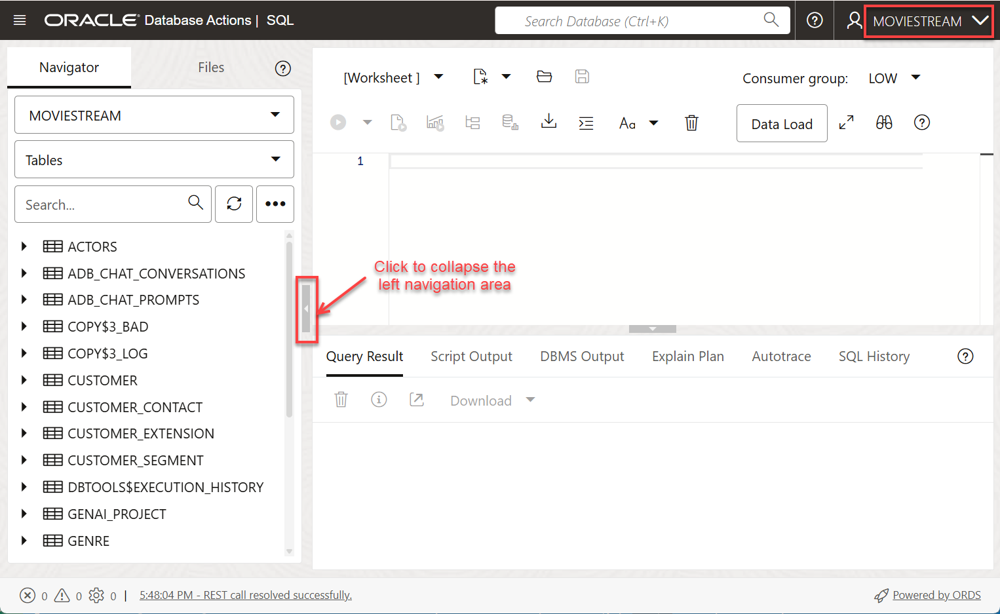
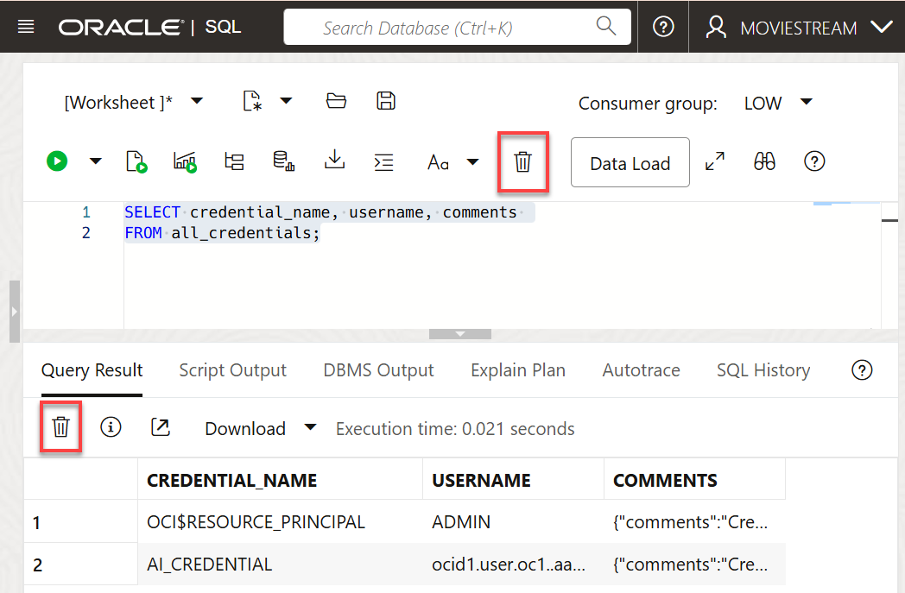

# Integrate GenAI models with Autonomous Database

## Introduction

LLMs can produce incredibly creative responses to prompts, generate SQL from natural language, and so much more. In order to be most effective, you want to leverage LLMs with your organization's private data. The first step is to integrate your models with Autonomous Database. 

You can use different LLMs with Autonomous Database. This lets you pick the best model for your use case. Select AI profiles encapsulate the connections to each model; you specify which profile to use when generating results. In this lab, you will enable the user **`MOVIESTREAM`** to connect to models from Oracle OCI GenAI, Azure OpenAI and Google Gemini.

Estimated Time: 10 minutes.

### Objectives

In this lab, you will:

* Connect Autonomous Database to an AI provider
* Test the AI profile

### Prerequisites
- This lab requires having access to a LiveLabs Sandbox reservation.

## Task 1: Log into the SQL Worksheet

The **`MOVIESTREAM`** user and its tables were created as part of your LiveLabs Sandbox reservation that you are using. You can find the URL to access **Database Actions** and the **`moviestream`** credentials (**`ADB Username`** and **`ADB User Password`**) in the **Reservation Information** panel for your reservation. 


1. On the **Reservation Information** panel for your reservation, click the **Database Actions** URL. The **Sign-in** page is displayed.

2. In the **Reservation Information** panel, click **Copy value** to the right of the **ADB Username** field, and then paste it in the **Username** field. Click **Copy value** to the right of the **ADB User Password** field, and then paste it in the **Password** field.

3. Click **Sign in**.

    

4. On the **Database Actions Launchpad** page, the **Development** is selected by default. Click the **SQL** tab; alternatively, you can click **Open**. 

    
    
5. The SQL Worksheet is displayed. The first time you open the SQL Worksheet, a series of pop-up informational boxes may appear. Close the boxes. 

    

## Task 2: Query the Available Native OCI Credential

In this workshop, we already created a new OCI credential for you named **`AI_CREDENTIAL`** that you will use to create the AI Profile.

1. Confirm the creation of the **`AI_CREDENTIAL`** OCI native credential. Copy the following query into your SQL Worksheet, and then click the **Run Statement** icon in the toolbar. The first time you paste content in your SQL Worksheet, a message box is displayed. Click **Allow**.
    
    ```sql
    <copy>
    SELECT credential_name, username, comments 
    FROM all_credentials;
    </copy>
    ```

    

     The **`AI_CREDENTIAL`** OCI native credential is displayed.

## Task 3: Connect Autonomous Database to an AI Provider and Create an AI Profile

### Background
There are 3 things to do in order to connect Autonomous Database to an AI provider:
1. Grant the **`MOVIESTREAM`** user network access to the AI provider endpoint
2. Create a credential containing the secret used to sign requests to the AI provider
3. Create a Select AI profile (see below for more details) 

>**Note:** All of these steps have already been done for accessing OCI GenAI when you deployed your Autonomous Database. You can review the deployment steps below. You will need to execute these steps when connecting to non-Oracle AI providers.

A Select AI profile encapsulates connection information for an AI provider. This includes: 

1. A security credential (e.g. the resource principal for OCI GenAI or a credential that captures a secret for a 3rd party AI provider)
2. The name of the provider
3. The name of the LLM (optional)
4. A list of target tables that will be used for natural language queries (required when using NL2SQL)

You can create as many profiles as you need, which is useful when comparing the quality or performance of the results of different models.

For a complete list of the Select AI profile attributes, see the [DBMS\_CLOUD\_AI\_Package] (https://docs.oracle.com/en/cloud/paas/autonomous-database/serverless/adbsb/dbms-cloud-ai-package.html#GUID-D51B04DE-233B-48A2-BBFA-3AAB18D8C35C) in the Using Oracle Autonomous Database Serverless documentation. 

### **Connect to the OCI Generative AI provider using the default model**

1. Click the **Clear** icon in the Worksheet area and the **Clear Output** icon in the Query Results area. 

    

2. Create a Select AI profile. Copy and paste the following code into your SQL Worksheet. A confirmation box is displayed. Click **Allow**. _Don't run the code yet. Substitute the place holder for the region attribute with your assigned region from the **Reservation Information** panel_. For example, if your Generative AI endpoint assigned region is `Brazil East (Sao Paulo) (sa-saopaulo-1)`, enter `sa-saopaulo-1` for the region parameter. Note that we are using the **`AI_CREDENTIAL`**. Next, click the **Run Script** icon. 

    ```sql
    <copy>
    begin    
    -- Drop the profile in case it already exists
    dbms_cloud_ai.drop_profile(
        profile_name => 'genai',
        force => true
    );    -- Create an AI profile that uses the default LLAMA model on OCI

    dbms_cloud_ai.create_profile(
        profile_name => 'genai',
        attributes =>
        '{"provider": "oci",
        "credential_name": "AI_CREDENTIAL",
        "region": "enter-your-assigned-region",
        "comments":"true",
        "object_list": [
            {"owner": "MOVIESTREAM", "name": "GENRE"},
            {"owner": "MOVIESTREAM", "name": "CUSTOMER"},
            {"owner": "MOVIESTREAM", "name": "PIZZA_SHOP"},
            {"owner": "MOVIESTREAM", "name": "STREAMS"},
            {"owner": "MOVIESTREAM", "name": "MOVIES"},
            {"owner": "MOVIESTREAM", "name": "ACTORS"}
        ]
        }'
    );
    end;
    /
    </copy> 
    ```

    

    >**Note:** The **region** attribute indicates the location of the Generative AI cluster that you want to use. 
    The default region is **`us-chicago-1`**. If you are using another region such as Frankfurt, **`eu-frankfurt-1`**, replace the **`us-chicago-1`** region's attribute value in the above code with **`eu-frankfurt-1`**. For the current list of regions with OCI Generative AI, see [Regions with Generative AI](https://docs.oracle.com/en-us/iaas/Content/generative-ai/overview.htm).

## Task 4: Test the AI Profile

We will use the Select AI PL/SQL API to generate a response from the AI model. This example is using the **chat** action. It is not using any private data coming from your database.

1. Test the LLM and learn about Autonomous Database as the **`MOVIESTREAM`** user. Copy and paste the following code into your SQL Worksheet, and then click the **Run Script** icon. Your answer may differ!

    ```
    <copy>
    SELECT DBMS_CLOUD_AI.GENERATE(
        prompt       => 'what is oracle autonomous database',
        profile_name => 'GENAI',
        action       => 'chat')
    FROM dual;
    </copy>
    ```
    

## Summary
You learned how to integrate Autonomous Database with your AI provider. And, you asked the model your first question using the "chat"action. Next, let's see how to use our private data with LLMs.
 
You may now proceed to the next lab.

## Learn More
* [DBMS\_NETWORK\_ACL\_ADMIN PL/SQL Package](https://docs.oracle.com/en/database/oracle/oracle-database/19/arpls/DBMS_NETWORK_ACL_ADMIN.html#GUID-254AE700-B355-4EBC-84B2-8EE32011E692)
* [DBMS\_CLOUD\_AI Package](https://docs.oracle.com/en-us/iaas/autonomous-database-serverless/doc/dbms-cloud-ai-package.html)
* [Using Oracle Autonomous Database Serverless](https://docs.oracle.com/en/cloud/paas/autonomous-database/adbsa/index.html)
* [Overview of Generative AI Service](https://docs.oracle.com/en-us/iaas/Content/generative-ai/overview.htm)

## Acknowledgements

* **Authors:**
    * Marty Gubar (Retired), Product Management
    * Lauran K. Serhal, Consulting User Assistance Developer
* **Contributors:** Michelle Malcher, Director, Product Management  
* **Last Updated By/Date:** Lauran K. Serhal, September 2025

Data about movies in this workshop were sourced from **Wikipedia**.

Copyright (c) 2025  Oracle Corporation.

Permission is granted to copy, distribute and/or modify this document
under the terms of the GNU Free Documentation License, Version 1.3
or any later version published by the Free Software Foundation;
with no Invariant Sections, no Front-Cover Texts, and no Back-Cover Texts.
A copy of the license is included in the section entitled [GNU Free Documentation License](https://oracle-livelabs.github.io/adb/shared/adb-15-minutes/introduction/files/gnu-free-documentation-license.txt)