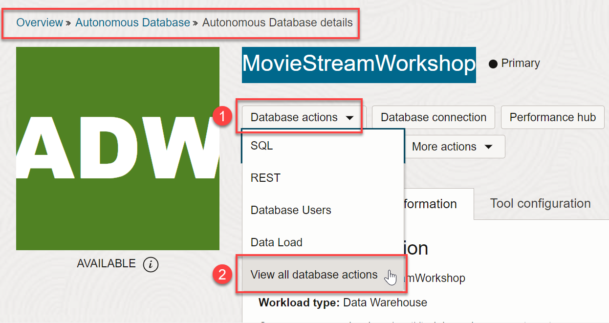
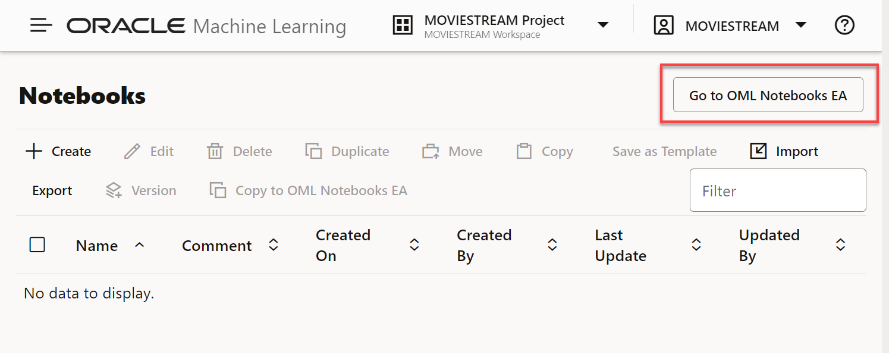
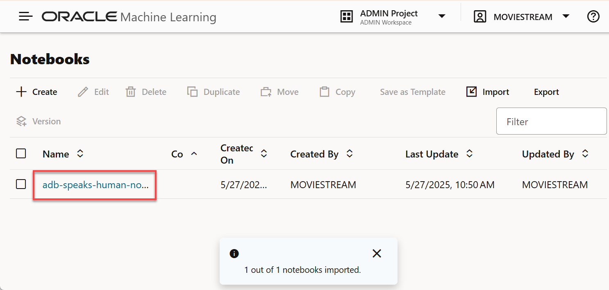
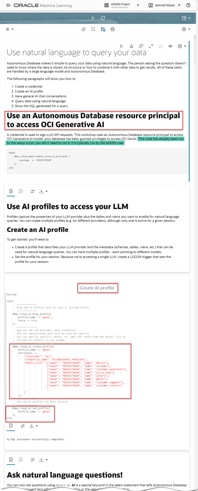

# Use Natural Language Queries with ADB Select AI

## Introduction

Autonomous Database makes it simple to query your data using natural language. The person asking the question doesn't need to know where the data is stored, its structure or how to combine it with other data to get results. All of these tasks are handled by a large language model and Autonomous Database.

In this lab, you will use an Oracle Machine Learning (OML) notebook to learn how to ask natural language queries with Autonomous Database. Although there are many SQL tools that you can use, we are using the notebook because it's a great way to illustrate the examples.

Estimated Time: 15 minutes.

### Objectives

In this lab, you will:

* Create a credential that is used to sign LLM API requests
* Create a profile that describes your LLM provider and the metadata (schemas, tables, views, etc.) that can be used for natural language queries.
* Ask natural language questions using an **Select AI** extension
* Tweak the configuration to improve natural language results

### Prerequisites

- This lab requires completion of the first two labs in the **Contents** menu on the left.

## Task 1: Access Oracle Machine Learning (OML) Notebooks

You can import, create, and work with notebooks in Oracle Machine Learning Notebooks. You can access Oracle Machine Learning Notebooks from Autonomous Database.

If you already have the **SQL| Oracle Database Actions** browser tab open from the previous lab, click the **Database Actions | SQL banner** to display the Database **Actions | Launchpad** Home page. In the **Development** section, click the **Oracle Machine Learning** card to display the **Sign In** page. Continue with step **step 7** below.

   

If you are no longer logged in to your Cloud account, start with **step 1** below.

1. Log in to the **Oracle Cloud Console** as the Cloud Administrator.

    >**Note:** To access **Database Actions** from the Console, you must log in as an **`ADMIN`** user.

2. On the **Sign In** page, select your tenancy, enter your username and password, and then click **Sign In**. The **Oracle Cloud Console** Home page is displayed.

3. Open the **Navigation** menu and click **Oracle Database**. Under **Oracle Database**, click **Autonomous Database**.

4. On the **Autonomous Databases** page, make sure that the **`your-compartment`** is selected in the **Compartment** drop-down list in the **List Scope** section, and then click your **`MovieStreamWorkshop`** ADB that you provisioned earlier.

5. On the **Autonomous Database Details** page, click the **Database Actions** drop-down list, and then select **View all database actions** from the list.

   

6. On the **Database Actions | Launchpad** page, in the **Development** section, click the **ORACLE MACHINE LEARNING** card.

    

7. On the **SIGN IN** page, enter **`moviestream`** in the **Username** field, the **`adb_user_password`** that you saved in **Lab 1 > Task 2 Step 6** in the **Password** field, and then click **Sign In**.

    

    The **Oracle Machine Learning** Home page is displayed. You can use this landing page to access tutorials, model creation, notebooks, and much more.

    

8. In the **Quick Actions** section, click the **Notebooks** button. The **Notebooks** page is displayed.

    

## Task 2: Import a Notebook into OML

You can import a notebook from a local disk or from a remote location if you provide the URL. A notebook named **ADB Speaks Human** contains all the steps for setting up the **Select AI** profile and then run natural language queries. In this task, you will first download the **ADB Speaks Human** OML notebook to your local machine, and then import this notebook into OML.

1. Click the following link to download the [ADB Speaks Human.dsnb](../notebook/ADB%20Speaks%20Human.dsnb) OML Notebook.

2. Click **Go to OML Notebooks EA**. The **OML Notebooks EA (Early Adopter)** page is displayed.

    

3. Click **Import**. The **Open** dialog box is displayed. Navigate to your local folder where you downloaded the OML notebook, and select the **`ADB Speaks Human.dsnb`** notebook file. The file is displayed in the **File name** field. Make sure that the **Custom Files (*.dsnb;\*.ipynb;\*.json;\*.zpln)** type is selected in the second drop-down field, and then click **Open**.

    

     If the import is successful, a notification is displayed and the **`ADB Speaks Human`** notebook is displayed in the list of available notebooks.

    

5. Open the imported notebook. Click the **ADB Speaks Human** notebook link. The notebook is displayed in the Notebook **Editor**.

    

## Task 3: Step thru the notebook paragraphs

A notebook is comprised of paragraphs that use different languages: SQL, PLSQL, Python, R, markdown and more. The **ADB Speaks Human** notebook is well-document. Read thru the notebook, examine and execute the code. Feel free to run different types of queries!

You'll see a series of buttons in the top right of each paragraph. The **play** button will execute the contents of that paragraph:

  

The results of the code execution is displayed under the paragraph code. For query result sets, you can view the data as a table or a variety of chart types.

## Learn More

* [OML Notebooks](https://docs.oracle.com/en/database/oracle/machine-learning/oml-notebooks/index.html)
* [Using Oracle Autonomous Database Serverless](https://docs.oracle.com/en/cloud/paas/autonomous-database/adbsa/index.html)

## Acknowledgements

* **Author** - Marty Gubar, Product Management
* **Contributors** -  Lauran K. Serhal, Consulting User Assistance Developer
* **Last Updated By/Date** - Lauran K. Serhal, Consulting User Assistance Developer, September 2023

Data about movies in this workshop were sourced from **Wikipedia**.

Copyright (C)  Oracle Corporation.

Permission is granted to copy, distribute and/or modify this document
under the terms of the GNU Free Documentation License, Version 1.3
or any later version published by the Free Software Foundation;
with no Invariant Sections, no Front-Cover Texts, and no Back-Cover Texts.
A copy of the license is included in the section entitled [GNU Free Documentation License](files/gnu-free-documentation-license.txt)
