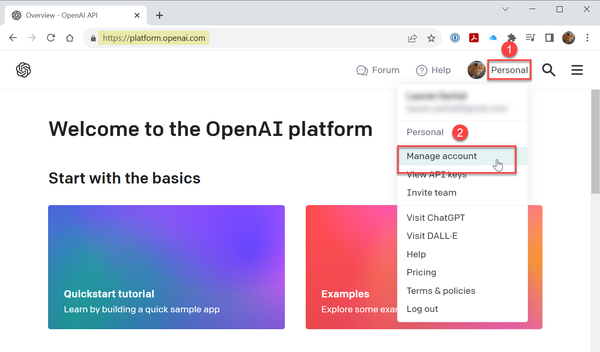
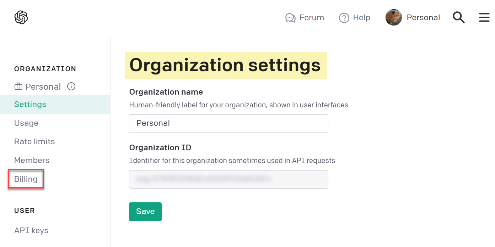
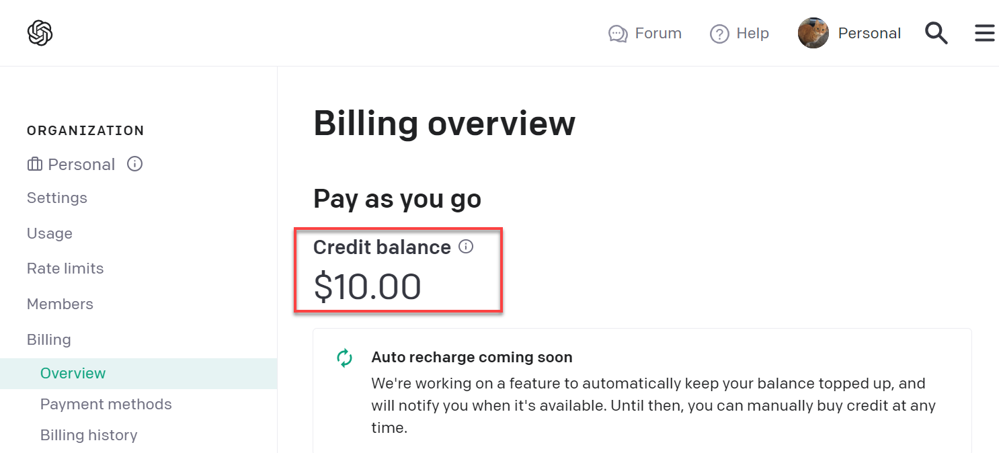

# Set up the Workshop Environment

<!---
comments syntax
--->

## Introduction

This workshop focuses on teaching you how to setup and use generative AI to query your data using natural language from a SQL prompt and from an application. To fast track using Select AI, you will deploy a ready-to-go environment using a terraform script that will:

* Provision your Autonomous Database instance with the required users and data
* Install the Select AI demo application that was built using APEX

The automation uses a predefined OCI Cloud Stack Template that contains all the resources that you need. You'll use OCI Resource Manager to deploy this template and make your environment available in just a few minutes. You can use Resource Manager for your own projects. For more details, see the [Overview of Resource Manager](https://docs.oracle.com/en-us/iaas/Content/ResourceManager/Concepts/resourcemanager.htm) Oracle Cloud Infrastructure documentation.

Autonomous Database supports models from **OCI Generative AI**, **Azure OpenAI**, **OpenAI**, and **Cohere**. This workshop will use the **Llama 3** model that's delivered with OCI Generative AI.

Estimated Time: 5 minutes.

### Objectives

In this lab, you will:

* Run the stack to perform all the prerequisites required to analyze data

<!---
Removed the following as Task 1 since we will start using OCI Generative AI

Sign up for Access to a Large Language Model (LLM)

Autonomous Database uses a large language model (LLM) to translate natural language to SQL. You can choose the LLM to use for your application.

Sign up for an **OpenAI** account as follows:

1. Click the following link to [create your OpenAI account](https://platform.openai.com/signup?launch). To create an account, you can use either an email address or a Google, Microsoft, or Apple account. In this workshop, we created a new account using the  **Continue with Google** option, and then followed the prompts.

      _**Important:** Make sure you create a paid account. API calls will fail if you use a free account._

      

    >**Note:** If you encounter problems creating a new account using an email address, then try using your Microsoft, Google, or Apple account instead of using an email address.

    Each LLM will have its own process for enabling access to its API. This workshop will use the **OpenAI GPT-3.5** model. This model requires that you sign up for a _paid developer account_. The cost for using OpenAI for this workshop is minimal, less than $ 1.

2. Create a **Paid developer account**. Navigate to the [Welcome to the OpenAI platform](https://platform.openai.com/) page. Click the account label, **Personal** in our example, and then select **Manage account** from the drop-down menu.

    

3. On the **Organization settings** page, click **Billing**.

    

4. On the **Billing overview** page, click **Start payment plan**.

    

5. In the **What best describes you?** dialog box, click either **Individual** or **Company**. In this example, we will choose **Individual**.

    

6. Complete the **Set up payment plan** dialog box, and then **Continue**.

    

7. In the **Configure payment** dialog box, enter the dollar amount of the credit you want to purchase (between 5 and 50), and then click **Continue**. In this example, we chose **$ 5**.

    

    A successful purchase message is displayed briefly. The **Billing overview** page is re-displayed. The updated credit balance is displayed. In our example the credit balance is now $10 because we had a free credit of $5 and we just purchased another $5.

    

Create a secret key as follows:

1. Click the following link to [create a new API secret key](https://platform.openai.com/account/api-keys). The secret key is used to sign requests to OpenAI's API. You will need it when creating a credential later. On the **API keys** page, click **Create new secret key**.

    

3. The **Create new secret key** dialog box is displayed with the newly created secret key which is blurred in this example for security reasons. Click the **Copy** icon to copy the key to the clipboard (in MS-Windows) and then save it to a text editor of your choice as you'll need it when you set up your connection to the service. Next, click **Done**.

    

    >**NOTE:** The secret key is only displayed once. You will need to create a new secret key if you lose this value.
--->

## Task 1: (Optional) Create an OCI Compartment

## Task 2: Create Policy to Enable Access to OCI Generative AI

**Note:** This task is only required if you are using **OCI Generative AI** as your AI provider.

Create a policy that will enable you to use **OCI Generative AI** within your previously defined compartment. **Make sure your policy uses the compartment where your Autonomous Database is deployed.** The policy will be necessary for Autonomous Database to interact with OCI Generative AI.

1. From the **Console,** open the **Navigation** menu and click **Identity & Security.** Under **Identity,** click **Policies.**.

2. Click **Create policy** and specify the following into the appropriate fields:

    >**Note:** Slide the **Show manual editor** control to display the text field in order to paste the policy.

    * **Name:** `PublicGenAI`
    * **Description:** `Public Gen AI Policy`
    * **Compartment:** Select your own compartment
    * **Policy Builder:** **`allow any-user to manage generative-ai-family in compartment training-adw-compartment`**
    
        > **Note:** Substitute `training-adw-compartment` in the above policy with your own compartment's name.

3. Click **Create**.

    
    
>**Note:** This policy allows any Autonomous Database in the specified compartment to access OCI Generative AI. In a production environment, ensure your policy's scope is minimally inclusive.

## Task 3: Provision an ADB Instance, Load Data, and Install the Select AI Demo Application 

You may now proceed to the next lab.

## Learn More

* [Using Oracle Autonomous Database Serverless](https://docs.oracle.com/en/cloud/paas/autonomous-database/adbsa/index.html)
* [Oracle Cloud Infrastructure](https://docs.cloud.oracle.com/en-us/iaas/Content/GSG/Concepts/baremetalintro.htm)
* [OpenAI API Get Started](https://platform.openai.com/docs/introduction)

## Acknowledgements

* **Author:** Lauran K. Serhal, Consulting User Assistance Developer
* **Contributor:** Marty Gubar, Product Manager
* **Last Updated By/Date:** Lauran K. Serhal, August 2025

Data about movies in this workshop were sourced from **Wikipedia**.

Copyright (c) 2025 Oracle Corporation.

Permission is granted to copy, distribute and/or modify this document
under the terms of the GNU Free Documentation License, Version 1.3
or any later version published by the Free Software Foundation;
with no Invariant Sections, no Front-Cover Texts, and no Back-Cover Texts.
A copy of the license is included in the section entitled [GNU Free Documentation License](https://oracle-livelabs.github.io/adb/shared/adb-15-minutes/introduction/files/gnu-free-documentation-license.txt)
