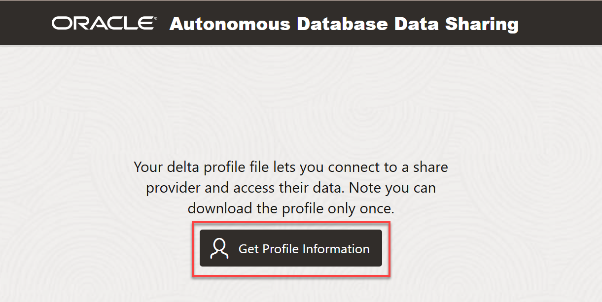
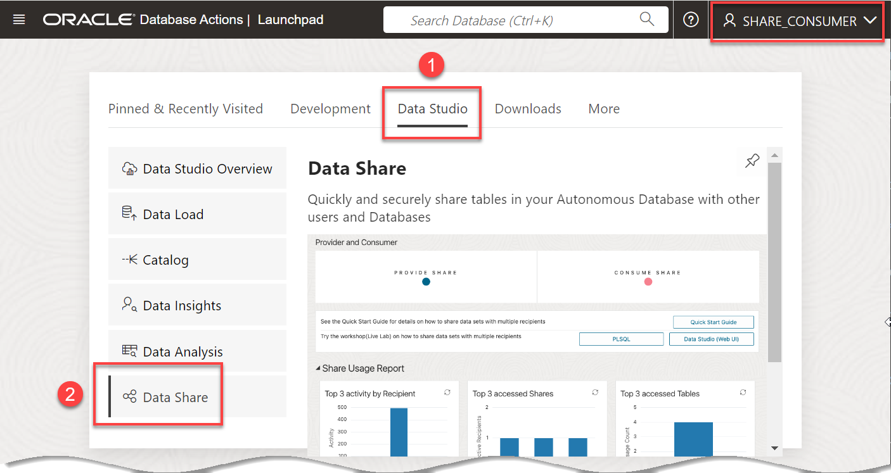
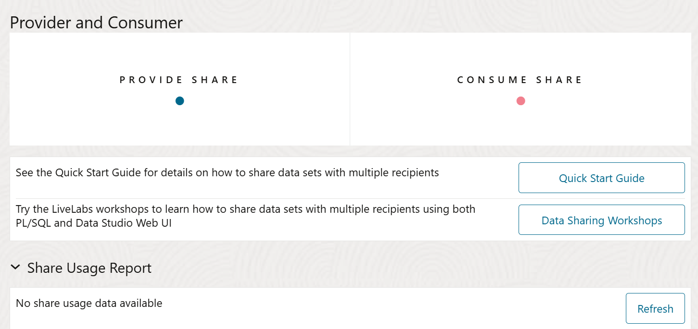
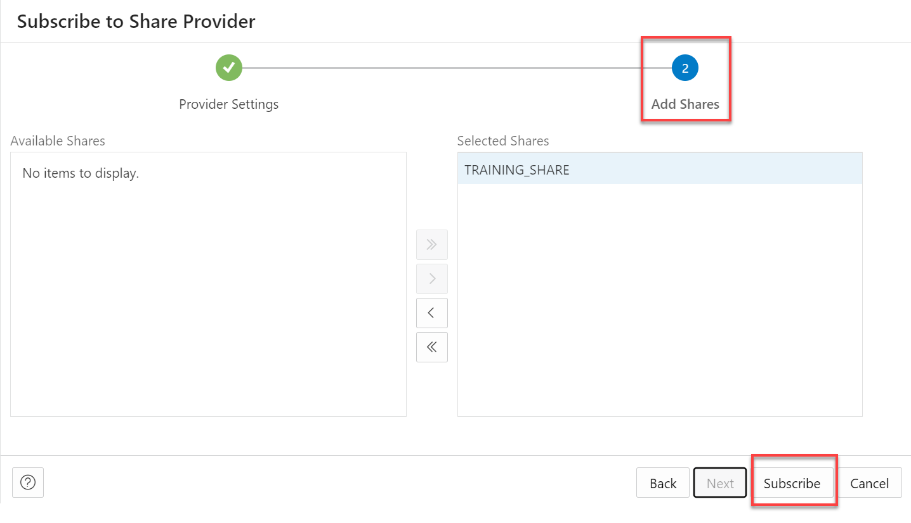
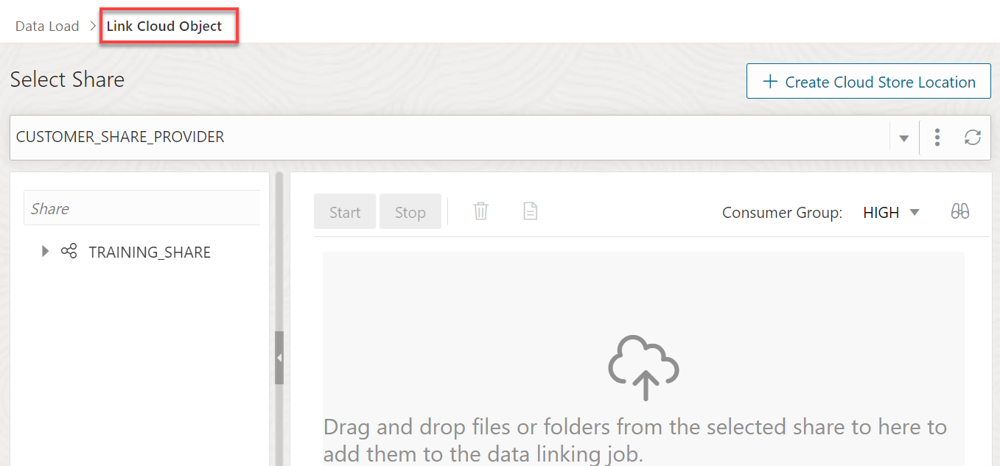
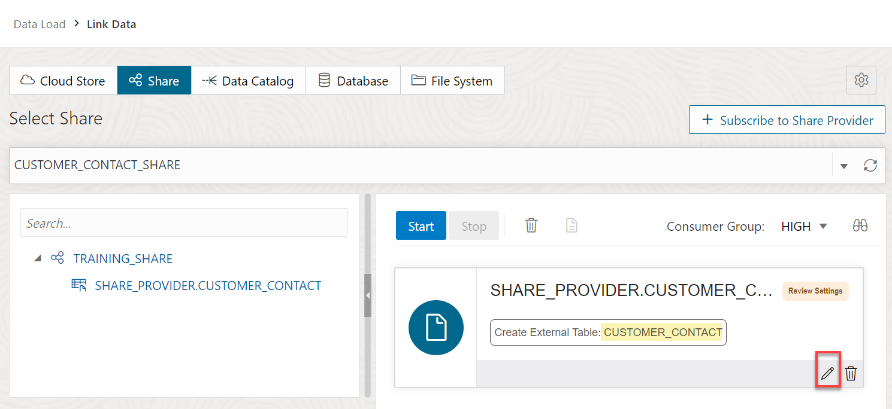
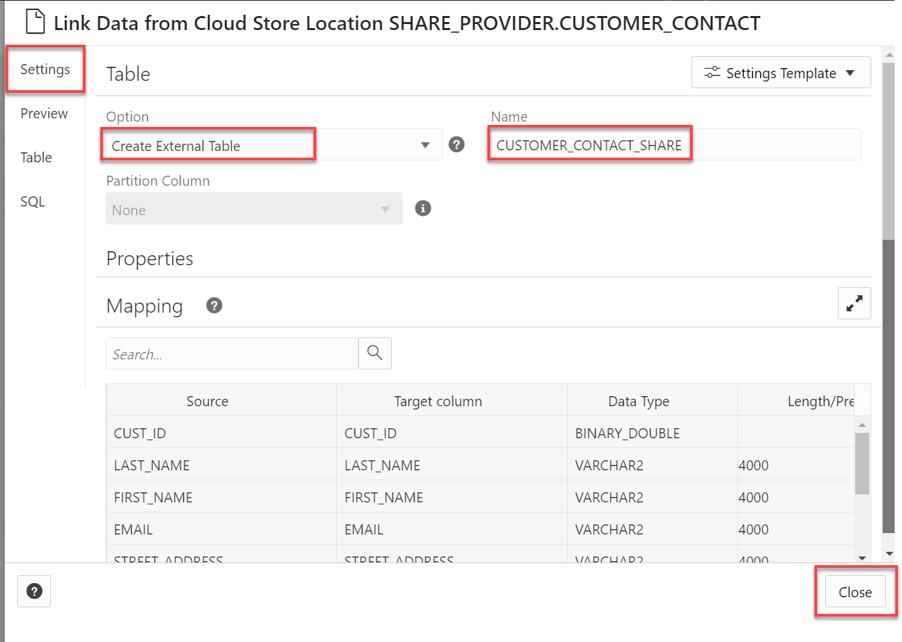
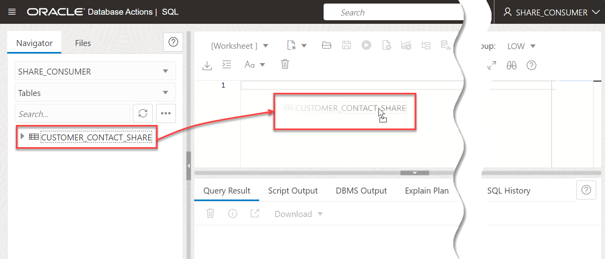

# Consume the Data Share by the Recipient

## Introduction

In this lab you will learn how to consume the data in your available data share as a recipient.


Estimated Time: 10 minutes

### Objectives

In this lab, you will:

* Request ACL privileges to the share provider's host that contains the share.
* Create access credential to the share.
* Subscribe to the data share provider.
* Access the data in your authorized data share.

### Prerequisites

This lab assumes that you have successfully completed all of the preceding labs in the **Contents** menu on the left.

## Task 1: Download the .json Configuration File

As the **`training_recipient`**, you can use the activation link URL that was sent to you by by the **`share_provider`** via email to download the **`delta_share_profile.json`** configuration file. This file (delta profile) contains the required credentials that you need in order to connect to the data share and access the **`CUSTOMER_CONTACT_SHARE`** table in the share.

>**Note:** To download the `.json` file as the recipient, it doesn't matter what user you are logged in as. All you need is a web browser.

1. Open the email message that was sent to you which contains the activation link URL.

    

2. Copy the activation link URL, and then paste it in your web browser's address bar. Alternatively, you can simply click the URL in the email message.

    

3. Press **[Enter]**. The **Autonomous Database Data Sharing** page is displayed. To download the config file, click **Get Profile Information**.

    

    >**Note:** You can download this profile file only once; therefore, make sure you save it once it's downloaded.

    The **Profile information downloaded** page is displayed and the name of the downloaded file, `delta_share_profile.json`, is displayed in a pop-up window. You can close this browser tab after the file is downloaded.

    

4. The **`delta_share_profile`.json** file is downloaded to your browser's **Downloads** directory.

    

5. Open the downloaded file to display its content. You will need this file to connect and use the data share.

    

<!--- comment
2. Log out of the `admin` user. On the **Oracle Database Actions | SQL** banner, click the drop-down list next to the `ADMIN` user, and then select **Sign Out** from the drop-down menu. Click **Leave**.

3. Log in as the newly created user, `share_consumer`. On the **Sign-in** page, enter **`share_consumer`** as the username and **`DataShare4ADW`** as the password, and then click **Sign in**.

    

    You are now logged in as the `share_consumer` user. In the **Development** section, click the **SQL** card to display the SQL Worksheet.
--->

## Task 2: Log in as the share_consumer User

1. Log in as the **`share_consumer`** user. On the **Sign-in** page, enter **`share_consumer`** as the username and **`TrainingADW`** as the password, and then click **Sign in**.

2. Scroll-down to the **Data Studio** section, and then click the **DATA SHARE** tile.

    

    The **Provider and Consumer** Home page is displayed.

    

## Task 3: Subscribe to Share Provider

To consume a data share, a recipient must have the required network connection to access the `share_provider` user host machine that contains the data share using `Port 443`. This is a virtual port used for secure internet network traffic and connection purposes using the `HTTPS` secure protocol. In order to set the ACL on the host machine for the recipient,  **`admin`** user (or some other privileged user with the `EXECUTE` privilege) will need the host machine **`endpoint`** value which you can find in the downloaded `JSON` profile file from the previous lab.

1. On the **Provider and Consumer** page, click the **CONSUME SHARE** tile to display the **Consume Share** page.

    

2. Click **+ Subscribe to Share Provider**.

    

3. The **Network ACL Script** dialog box is displayed. Before you can access the data share to which the `share_provider` user gave you access, you need to be able to access the `share_provider` user host machine. _**This is a task for an `admin` or a privileged user and will only need to be performed once**._ Accept the selected **Allow access to Host Only** option. Click the **Copy** icon to copy the script into your clipboard so that you can share it with your **`admin`** user that will run on your behalf. The same code is also available below for your convenience. You can choose to copy that code and share it with your admin. The host value in the script will be different than the one you will use. You can find your host value in the `.JSON profile` that you downloaded earlier.
For information about the `DBMS_NETWORK_ACL_ADMIN` package, see the [PL/SQL Packages and Types Reference](https://docs.oracle.com/en/database/oracle/oracle-database/19/arpls/DBMS_NETWORK_ACL_ADMIN.html#GUID-254AE700-B355-4EBC-84B2-8EE32011E692) documentation.

    

    > **Important:** Don't proceed with the next steps until your `admin` user grants you access to the `share_provider` user host machine.

### **The `admin` user grants the recipient access to the `share_provider` host machine**

As an `admin` user, if you already received the script from your recipient, navigate to the SQL Worksheet, and then run the script. Alternatively, you can copy and paste the following script into your SQL Worksheet, and then click the **Run Script** icon.

```
<copy>
BEGIN
DBMS_NETWORK_ACL_ADMIN.APPEND_HOST_ACE(
    host => 'ukgyxp2x0rqadss-trainingadw.adb.ca-toronto-1.oraclecloudapps.com',
    lower_port => 443,
    upper_port => 443,
    ace => xs$ace_type(
    privilege_list => xs$name_list('http', 'http_proxy'),
    principal_name => upper('DWROLE'),
    principal_type => xs_acl.ptype_db));
END;
/
</copy>
```


The `admin` user informs the recipient that he or she has access to the `share_provider`'s host machine; therefore, the recipient can now subscribe to the share provider.

4. As the **`share_consumer`** recipient, once your `admin` user grants you access to the `share_provider` user host machine, you can continue with the steps for **+ Subscribe to Share Provider**. In the **Subscribe to Share Provider** wizard, on the **Provider Settings** page, provide the following information:

    * **Share Provider JSON:** Accept the **From file** option.
    * **Delta Share Profile JSON:** Click this field to display the **Open** dialog box. Navigate to your **Downloads** directory where you downloaded the **`delta_share_profile.json`** file, and then click **Open**.

        
    * **Provider Name:** Enter a name such as **`CUSTOMER_CONTACT_SHARE`**.
    * **Description:** Enter an optional description.

        

5. Click **Next**. On the **Add Shares** page, click the **TRAINING_SHARE** in the **Available Shares** section, and then click the **Select** (>) icon.

    

    The share is added to the **Selected Shares** section. Click **Subscribe**.

    

    A **`CUSTOMER_CONTACT_SHARE` share provider was created successfully**  informational message is displayed. You are directed to the **Link Cloud Object** page.

    

## Task 4: Create an External Table over the Shared Table

1. Expand the **TRAINING_SHARE** data share node to display the objects in it. Drag and drop the **`CUSTOMER_CONTACT`** shared table to add it to the data link job.

    

2. The shared table is added to the data link job. When you run this job, a new **`CUSTOMER_CONTACT`** external table will be created on top of the **`CUSTOMER_CONTACT`** table that was shared with you. Before you create the external table, change its name from **`CUSTOMER_CONTACT`** to **`CUSTOMER_CONTACT_SHARE`**. Click the ellipsis icon, and then click **Settings** from the context menu.

    

3. In the **Link Data from Cloud Store Location SHARE_PROVIDER.CUSTOMER\_CONTACT** dialog box, change the name of the external table that will be generated to **`CUSTOMER_CONTACT_SHARE`**, and then click **Close**.

    

    The **Link Cloud Object** page is re-displayed.

    

4. Click **Start**. A **Run Data Load Job** dialog box is displayed. Click **Run**. When the job completes successfully, a green **Complete** icon with a checkmark is displayed. The **`CUSTOMER_SHARE`** external table is created. Click **Done**.

    

5. Click the **Database Actions | Launchpad** banner, and then select the **SQL** tile from the **Development** section to display the SQL Worksheet.

    

6. From the **Navigator** tab, drag and drop the **`CUSTOMER_CONTACT_SHARE`** table onto the canvas.

    

7. A **Choose the type of insertion** dialog box is displayed. Click **Select**, and then click **Apply**.

    

    The automatically generated query is displayed in the Worksheet.

5. Click the **Run Statement** icon in the Toolbar. The query result is displayed in the **Query Result** tab.

    

You may now proceed to the next lab.

## Learn More

* [Oracle Cloud Infrastructure Documentation](https://docs.cloud.oracle.com/en-us/iaas/Content/GSG/Concepts/baremetalintro.htm)
* [Using Oracle Autonomous Database Serverless](https://docs.oracle.com/en/cloud/paas/autonomous-database/adbsa/index.html)

## Acknowledgements

* **Author:** Lauran K. Serhal, Consulting User Assistance Developer
* **Contributor:** Alexey Filanovskiy, Senior Principal Product Manager
* **Last Updated By/Date:** Lauran K. Serhal, August 2023

Data about movies in this workshop were sourced from Wikipedia.

Copyright (C) Oracle Corporation.

Permission is granted to copy, distribute and/or modify this document
under the terms of the GNU Free Documentation License, Version 1.3
or any later version published by the Free Software Foundation;
with no Invariant Sections, no Front-Cover Texts, and no Back-Cover Texts.
A copy of the license is included in the section entitled [GNU Free Documentation License](files/gnu-free-documentation-license.txt)