# Use Data Share Advanced Tips

## Introduction

As your organization starts sharing data externally using Oracle Delta Sharing, it's essential to monitor how that data is published, distributed, and accessed. Oracle provides a rich set of system views that help you track the following:

* Published versions of your shares
* Event history for each share
* Detailed file-level metadata
* Share job statuses
* List of recipients and their access status

In this lab, you will use these views to gain visibility into your shared datasets and ensure everything is running smoothly.

Estimated Time: 10 minutes

### Objectives

In this lab, you will:

* Monitor Oracle delta sharing.
* Extend token lifetime.
* Enable versioned access for shared data.
* Call a delta sharing endpoint from PL/SQL.
* Publish the data share to make it available to authorized recipients.

### Prerequisites

This lab assumes that you have successfully completed all of the preceding labs in the **Contents** menu on the left.

## Task 1: Monitor Oracle Delta Share

In this task, log in as the **`share_provider`** user.

1. Use the **`all_share_versions`** view to list all published versions of data shares.
Each version corresponds to a consistent snapshot of the shared data. Columns include the version number, creation timestamp, number of files, and the total size of files (in bytes).
Copy and paste the following query into your SQL Worksheet, and then click the **Run Statement** icon in the Worksheet toolbar.

    ```
    <copy>
    SELECT *
    FROM all_share_versions;
    </copy>
    ```

    

    >**Note:** Use this view to track how often shares are updated and how large they are.
    This is useful for understanding data growth and frequency of publication.

2. Use the **`all_share_events`** view to view the event history for all shares. This view logs detailed events related to data share publishing. Events include version creation, failures, retries, and so on. It also helps to troubleshoot and audit publishing activities. Copy and paste the following query into your SQL Worksheet, and then click the **Run Statement** icon in the Worksheet toolbar.

    ```
    <copy>
    SELECT *
    FROM all_share_events;
    </copy>
    ```

    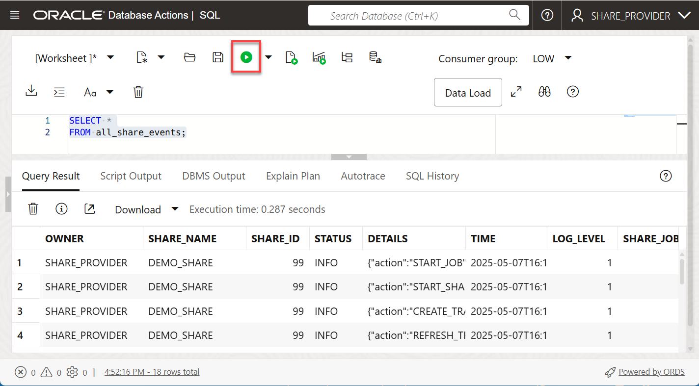

    >**Note:** Filter by **`EVENT_TYPE`** or **`SHARE_NAME`** to investigate specific activity.

3. Use the **`all_share_files`** view to list all files that are included in shares. This view provides a file-level breakdown of all shared versions. Each record maps a Parquet file to its corresponding version and share. This is great for understanding data layout and optimizing storage. Copy and paste the following query into your SQL Worksheet, and then click the **Run Statement** icon in the Worksheet toolbar.

    ```
    <copy>
    SELECT *
    FROM all_share_files;
    </copy>
    ```

    

    >**Note:** Check for unusually large or numerous files that could impact performance.

4. Use the **`user_share_jobs`** view to monitor your personal share jobs. This view lists all jobs that the current user has submitted related to publishing or managing shares. It is useful to track job status, start/end time, and any errors. Copy and paste the following query into your SQL Worksheet, and then click the **Run Statement** icon in the Worksheet toolbar.

    ```
    <copy>
    SELECT *
    FROM user_share_jobs;
    </copy>
    ```

    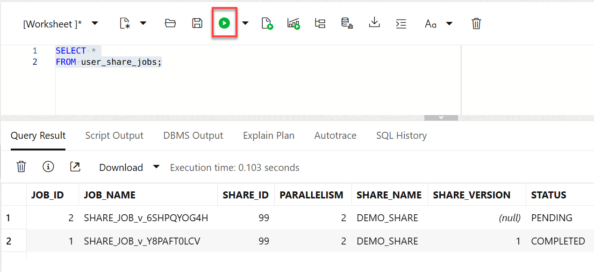

    >**Note:** Job statuses like `RUNNING`, `COMPLETED`, or `FAILED` will help you debug issues.

5. Use the **`user_share_recipients`** view to display all recipients of your shares. This view shows who is receiving your shared datasets. It includes recipient identifiers, status such as `ACTIVE`, `INACTIVE`, and timestamps. This is essential for monitoring usage and access control. Copy and paste the following query into your SQL Worksheet, and then click the **Run Statement** icon in the Worksheet toolbar.

    ```
    <copy>
    SELECT *
    FROM USER_SHARE_RECIPIENTS;
    </copy>
    ```

    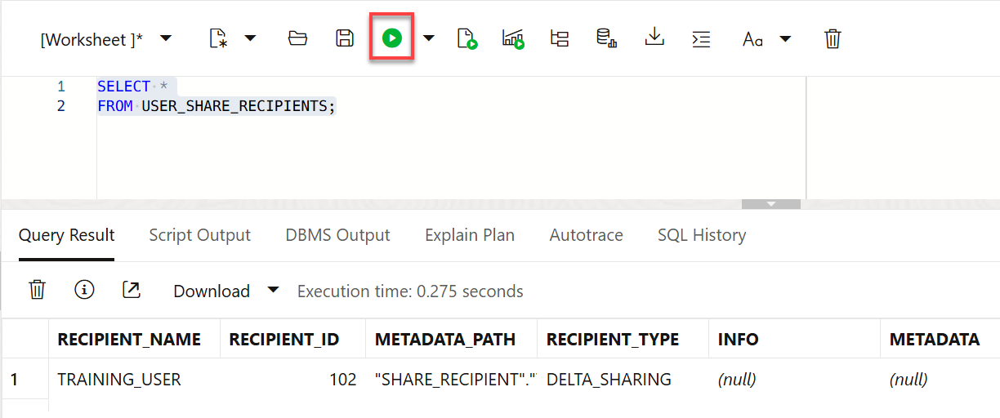

    >**Note:** Review regularly to clean up unused recipients or check access issues.

## Task 2: Extend Token Lifetime

By default, share recipients are issued access tokens valid for up to 90 days. This may not be enough for long-term consumers or automated pipelines. If you are an admin user, you can extend the token lifetime. In this task, you will learn how to do the following:

* View and change the **`MAX_TOKEN_LIFETIME`** setting.
* Update a specific recipient’s token lifetime.
* Verify the change.
* Enable versioned access for fine-grained control.

1. Let’s check the current recipients. Copy and paste the following query into your SQL Worksheet, and then click the **Run Statement** icon in the Worksheet toolbar.

    ```
    <copy>
    SELECT *
    FROM user_share_recipients;
    </copy>
    ```

    

2. Let's create a new recipient. You can create a recipient with an email or identity-based auth. Copy and paste the following query into your SQL Worksheet, and then click the **Run Script** icon in the Worksheet toolbar.

    ```
    <copy>
    BEGIN
        DBMS_SHARE.CREATE_SHARE_RECIPIENT('training2_recipient', email=>'training2@example.com');
    END;
    </copy>
    ```

    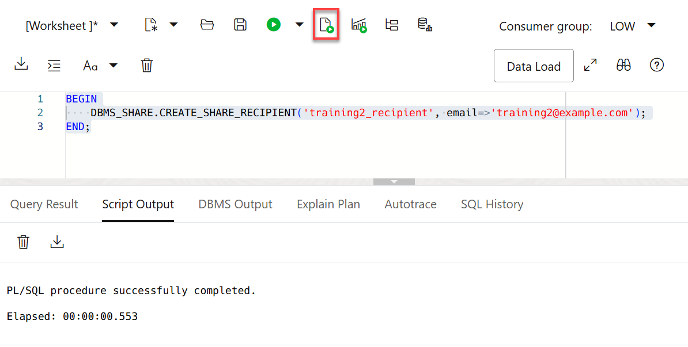

3. Try setting a token lifetime to greater than 90 days. This should fail. The default maximum token lifetime is 90 days. Setting it to 91 days will trigger an error. Copy and paste the following query into your SQL Worksheet, and then click the **Run Script** icon in the Worksheet toolbar.

    ```
    <copy>
    BEGIN
        DBMS_SHARE.UPDATE_RECIPIENT_PROPERTY('training2_recipient', 'token_lifetime', '91 00:00:00');
    END;
    </copy>
    ```

    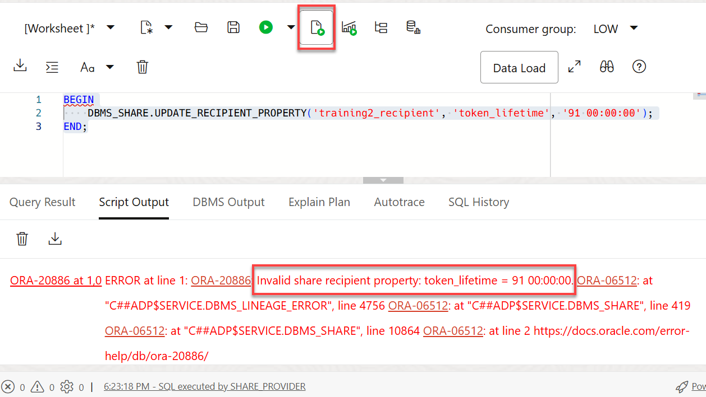

    The expected `ORA-20886: Invalid share recipient property: token_lifetime = 91 00:00:00.` error is displayed.

4. **`Admin`** users can inspect and change the current global token lifetime setting. On the **Oracle Database Actions | SQL** banner, click the drop-down list next to the `share_provider` user, and then select **Sign Out** from the drop-down menu. On the **Sign in** page, log back in as the **`admin`** user. Copy and paste the following query into your SQL Worksheet, and then click the **Run Statement** icon in the Worksheet toolbar.

    ```
    <copy>
    SELECT setting_value
    FROM all_share_default_settings
    WHERE setting = 'MAX_TOKEN_LIFETIME';
    </copy>
    ```

    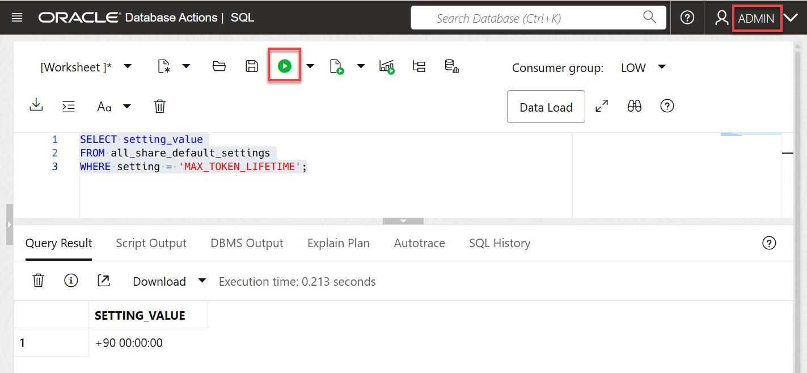

5. Increase the global limit to **`720`** days. Again, only `ADMIN` users can change this setting; therefore, make sure you are logged in as the `ADMIN` user. Copy and paste the following query into your SQL Worksheet, and then click the **Run Script** icon in the Worksheet toolbar.

    ```
    <copy>
    BEGIN
        DBMS_SHARE.UPDATE_DEFAULT_RECIPIENT_PROPERTY('max_token_lifetime', '720 00:00:00');
    END;
    </copy>
    ```

    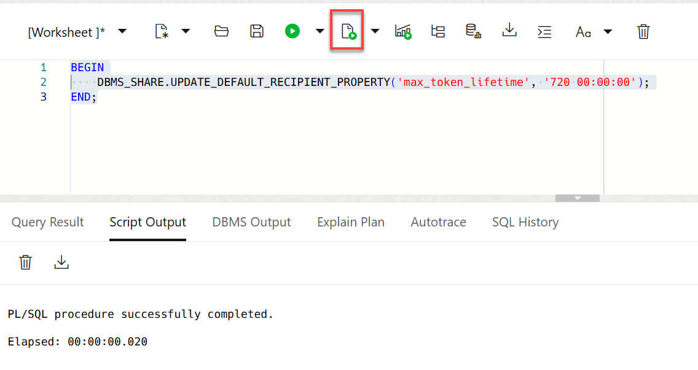

6. Verify the change. Copy and paste the following query into your SQL Worksheet, and then click the **Run Statement** icon in the Worksheet toolbar.

    ```
    <copy>
    SELECT setting_value
    FROM all_share_default_settings
    WHERE setting = 'MAX_TOKEN_LIFETIME';
    </copy>
    ```

    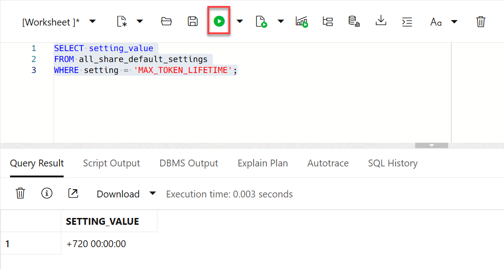

7. Logout of the **`admin`** user, and then log in as the **`share_provider`** user. Try updating the recipient token again using **`500`** days as the token lifetime value. Copy and paste the following query into your SQL Worksheet, and then click the **Run Script** icon in the Worksheet toolbar.

    ```
    <copy>
    EXEC DBMS_SHARE.UPDATE_RECIPIENT_PROPERTY('training2_recipient', 'token_lifetime', '500 00:00:00');
    </copy>
    ```

    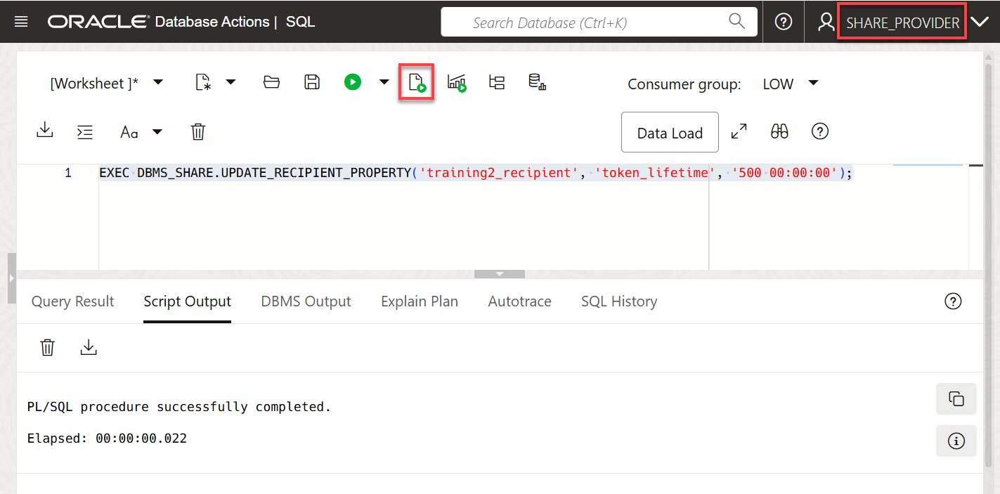

8. Verify the new lifetime value. Convert seconds to days. Copy and paste the following query into your SQL Worksheet, and then click the **Run Statement** icon in the Worksheet toolbar.

    ```
    <copy>
    SELECT DBMS_SHARE.GET_RECIPIENT_PROPERTY('training2_recipient', 'token_lifetime')/(60*60*24) AS lifetime_in_days
    FROM dual;
    </copy>
    ```

    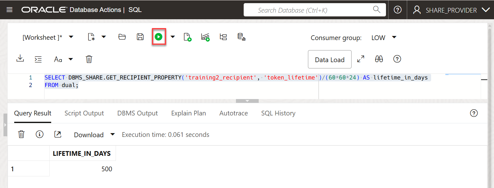

## Task 3: Enable Versioned Access for Shared Data

Oracle Autonomous Database (ADB) does not enable *versioned shares* by default. This means consumers can only access the most recent version of a shared dataset; However, some use cases require querying historical versions for debugging, compliance, or reproducibility in analytics pipelines.

In this task, you'll learn how to enable *versioned access* both at the recipient level and
at the share level.

1. Enable versioned access for a specific recipient such as **`training2_recipient`** that you already created earlier. This grants the recipient permission to query specific historical versions (via version numbers) of the share. Copy and paste the following query into your SQL Worksheet, and then click the **Run Script** icon in the Worksheet toolbar.

    ```
    <copy>
    BEGIN
        dbms_share.update_recipient_property(
            'training2_recipient',         -- Recipient name
            'version_access',              -- Property name
            dbms_share.version_access_any  -- Allow access to all available versions
        );
    END;
    /
    </copy>
    ```

    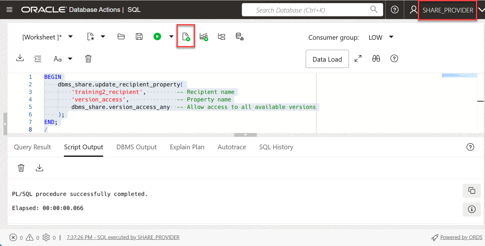

    You’ve now allowed the specified recipient to request older versions of the data.

2. Enable versioned access for the share itself. Even if the recipient has version access enabled, the share must explicitly support it. Copy and paste the following query into your SQL Worksheet, and then click the **Run Script** icon in the Worksheet toolbar.

    ```
    <copy>
    BEGIN
        dbms_share.update_share_property(
            'demo_share',                   -- Share name
            'version_access',               -- Property name
            dbms_share.version_access_any   -- Enable versioned access
        );
    END;
    /
    </copy>
    ```

    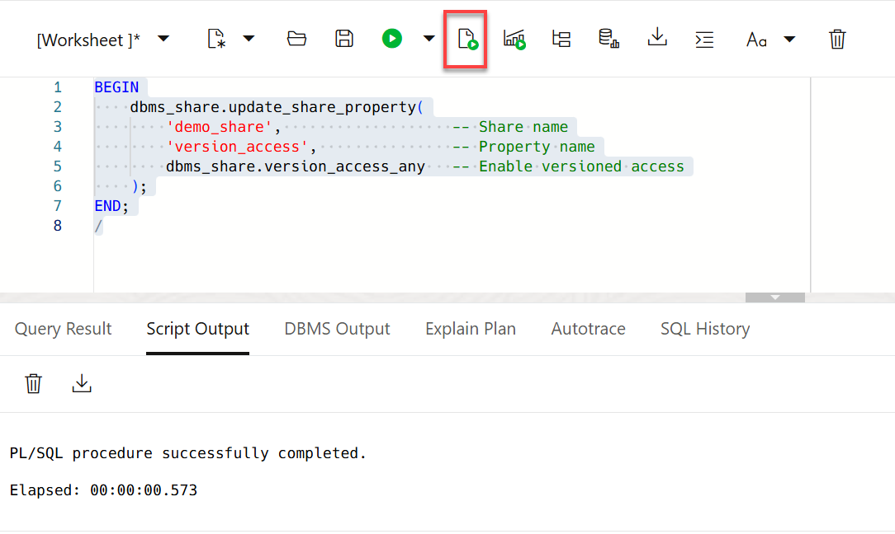

    This share allows consumers to query older versions, if the recipients have the required permissions.

    >**Note:** Shares and recipients must *both* have `version_access` enabled for versioned queries to succeed.

## Task 4: Call a Delta Sharing Endpoint from PL/SQL

 When integrating with external Delta Sharing providers such as Databricks, it's important to verify that the Delta Sharing endpoint is reachable from Oracle ADB. This task shows how to configure network access and call the API to list shares and tables in the shares using PL/SQL.

Prerequisite:

You must have a valid Delta Sharing activation profile with:

* endpoint URL
* bearer token
* optional expiration date

**Example:**


In this task, as the `admin` user, you will create an Access Control List (ACL) to allow outbound connections over HTTPS. This involves providing the following:

Oracle Autonomous Database uses Access Control Lists (ACLs) to control access to external network resources. In this step, you will do the following:

* Create an ACL file.
* Grant `HTTPS` (port 443) access to a specific host, Databricks endpoint in our example.
* Grant DNS resolution rights to the user (or role), `admin` in our example.

1. Log out of the `share_provider` user and then log in as the **`admin`** user. Create an Access Control List (ACL) to allow outbound connections over HTTPS for the `admin` user. Copy and paste the following script into your SQL Worksheet, and then click the **Run Script** icon in the Worksheet toolbar.

    ```
    <copy>
    BEGIN
    -- Create an Access Control List (ACL) to allow outbound connections over HTTPS
    DBMS_NETWORK_ACL_ADMIN.CREATE_ACL(
        ACL         => 'databricks_acl_west.xml', -- XML file name for ACL config
        DESCRIPTION => 'Allow outbound HTTPS requests',
        PRINCIPAL   => 'ADMIN',                    -- Grant to this user or role
        IS_GRANT    => TRUE,
        PRIVILEGE   => 'connect'                   -- Allow connect privilege
    );

    -- Assign this ACL to the Databricks host on port 443 (HTTPS)
    DBMS_NETWORK_ACL_ADMIN.assign_acl(
        acl         => 'databricks_acl_west.xml',
        host        => 'westus.azuredatabricks.net',
        lower_port  => 443,
        upper_port  => 443
    );

    -- Optionally grant permission to resolve hostnames (DNS lookup)
    DBMS_NETWORK_ACL_ADMIN.ADD_PRIVILEGE(
        ACL         => 'databricks_acl_west.xml',
        PRINCIPAL   => 'ADMIN',
        IS_GRANT    => TRUE,
        PRIVILEGE   => 'resolve'
    );
    END;
    /
    </copy>
    ```

    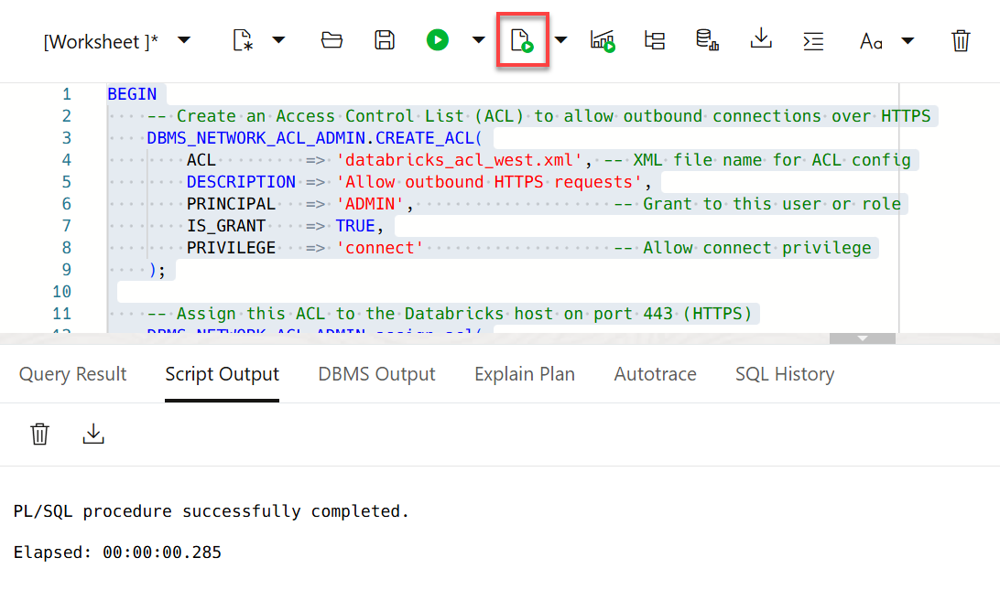

2. In this step, you will do the following:

* Define the Delta Sharing API endpoint and token.
* Call the `/shares` endpoint to list shares.
* Call the `/tables` endpoint to list tables in a specific share.
* Use `UTL_HTTP` to send `HTTPS` requests and read responses.

    Copy and paste the following script into your SQL Worksheet, and then click the **Run Script** icon in the Worksheet toolbar.

    ```
    <copy>
    DECLARE
        --  Define the endpoint and authorization information
        V_ENDPOINT       VARCHAR2(4000) := 'https://westus.azuredatabricks.net/api/2.0/delta-sharing/metastores/1740e12d-77bc-4bf8-a9d0-14e932246739';
        V_URL_SHARES     VARCHAR2(4000) := V_ENDPOINT || '/shares'; -- URL to list shares
        V_URL_TABLES     VARCHAR2(4000);                             -- URL to list tables in a specific share
        V_BEARER_TOKEN   VARCHAR2(200) := 'FRBK-SjR2cGT58dD8VMyEAyTagaiSJ6D0UKljjqDcTbZciBNpmX1F3c5R1oz85L0';
        V_RESPONSE       CLOB;

        -- Variables for managing HTTP request and response
        L_HTTP_REQ       UTL_HTTP.REQ;
        L_HTTP_RESP      UTL_HTTP.RESP;
        L_BUFFER         VARCHAR2(32767);

        -- Procedure to call an API URL and return the response as CLOB
        PROCEDURE FETCH_API_RESPONSE (
            P_URL      VARCHAR2,
            P_RESPONSE OUT CLOB
        ) IS
        BEGIN
            -- Start HTTP GET request
            L_HTTP_REQ := UTL_HTTP.BEGIN_REQUEST(P_URL, 'GET');

            -- Add required headers: Authorization and Content-Type
            UTL_HTTP.SET_HEADER(L_HTTP_REQ, 'Authorization', 'Bearer ' || V_BEARER_TOKEN);
            UTL_HTTP.SET_HEADER(L_HTTP_REQ, 'Content-Type', 'application/json');

            -- Execute the request and get the response
            L_HTTP_RESP := UTL_HTTP.GET_RESPONSE(L_HTTP_REQ);

            --Create a temporary CLOB to store the response
            DBMS_LOB.CREATETEMPORARY(P_RESPONSE, TRUE);

            -- Read the response in chunks and append to the CLOB
            LOOP
                BEGIN
                    UTL_HTTP.READ_TEXT(L_HTTP_RESP, L_BUFFER, 32767);
                    DBMS_LOB.APPEND(P_RESPONSE, L_BUFFER);
                EXCEPTION
                    WHEN UTL_HTTP.END_OF_BODY THEN
                        EXIT;
                END;
            END LOOP;

            -- Always clean up the HTTP response to free memory
            UTL_HTTP.END_RESPONSE(L_HTTP_RESP);

        EXCEPTION
            WHEN OTHERS THEN
                -- If there's an error, ensure the response is still closed
                BEGIN
                    UTL_HTTP.END_RESPONSE(L_HTTP_RESP);
                EXCEPTION
                    WHEN OTHERS THEN NULL; -- Suppress secondary error
                END;
                RAISE; -- Propagate the original error
        END FETCH_API_RESPONSE;

    BEGIN
      -- Call the /shares endpoint and print the result
        FETCH_API_RESPONSE(V_URL_SHARES, V_RESPONSE);
        DBMS_OUTPUT.PUT_LINE('Shares: ' || V_RESPONSE);

        -- Call the /tables endpoint for a specific share, 'dbr2oracle' in our example
        
        V_URL_TABLES := V_ENDPOINT || '/shares/dbr2oracle/schemas/default/tables';
        FETCH_API_RESPONSE(V_URL_TABLES, V_RESPONSE);
        DBMS_OUTPUT.PUT_LINE('Tables in dbr2oracle: ' || V_RESPONSE);
    END;
    /
    </copy>
    ```

    You are done! If the endpoint is accessible and the token is valid, you’ll see the list of shares and tables printed in the output.

    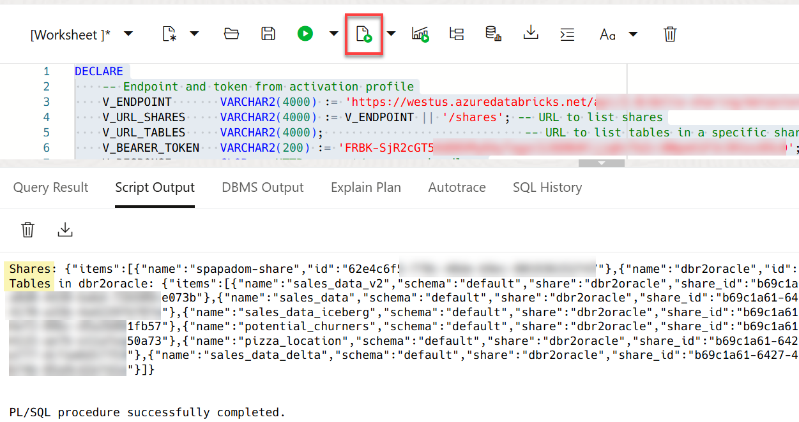

You may now proceed to the next lab.

## Learn More

* [Oracle Cloud Infrastructure Documentation](https://docs.cloud.oracle.com/en-us/iaas/Content/GSG/Concepts/baremetalintro.htm)
* [Using Oracle Autonomous Database Serverless](https://docs.oracle.com/en/cloud/paas/autonomous-database/adbsa/index.html)

## Acknowledgements

* **Author:** Lauran K. Serhal, Consulting User Assistance Developer
* **Contributor:** Alexey Filanovskiy, Senior Principal Product Manager
* **Last Updated By/Date:** Lauran K. Serhal, May 2025

Data about movies in this workshop were sourced from Wikipedia.

Copyright (C), 2025 Oracle Corporation.

Permission is granted to copy, distribute and/or modify this document
under the terms of the GNU Free Documentation License, Version 1.3
or any later version published by the Free Software Foundation;
with no Invariant Sections, no Front-Cover Texts, and no Back-Cover Texts.
A copy of the license is included in the section entitled [GNU Free Documentation License](https://oracle-livelabs.github.io/adb/shared/adb-15-minutes/introduction/files/gnu-free-documentation-license.txt)
