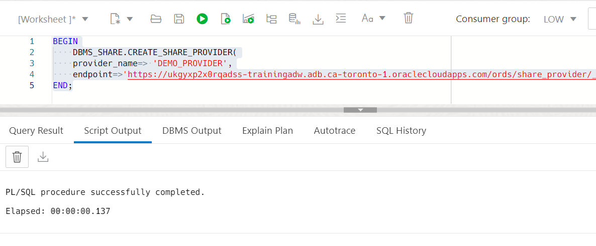
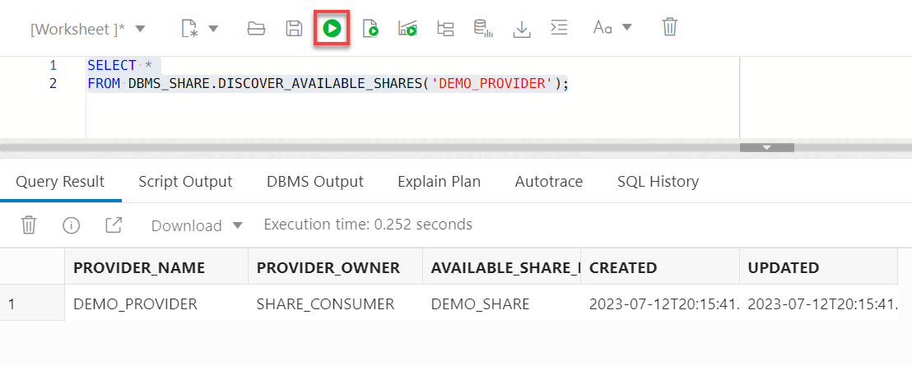
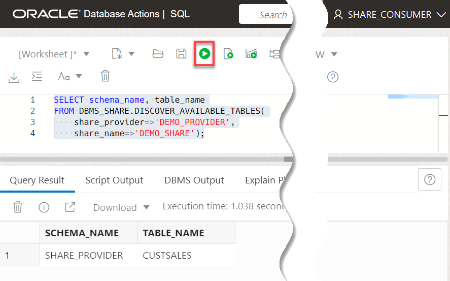

# Consume the Data Share by the Recipient

## Introduction

In this lab you will learn how to consume the data in your available data share as a recipient.

Estimated Time: 10 minutes

### Objectives

In this lab, you will:

* Access the data in your authorized data share.

### Prerequisites

This lab assumes that you have successfully completed all of the preceding labs in the **Contents** menu on the left.

## Task 1: Navigate to the SQL Worksheet

1. If you still have your SQL Worksheet open, skip over to step **Task: 2**; otherwise, to navigate to the SQL Worksheet, log in to the **Oracle Cloud Console**, if you are not already logged in.

2. Open the **Navigation** menu and click **Oracle Database**. Under **Oracle Database**, click **Autonomous Database**.

3. On the **Autonomous Databases** page, click your **ADW-Data-Lake** ADB instance.

4. On the **Autonomous Database details** page, click **Database actions**.

5. On the **Database Actions | Launchpad** Home page, in the **Development** section, click the **SQL** card to display the SQL Worksheet.

## Task 2:  Grant Required Privileges and Review Prerequisites

1. To consume a data share, a user must set up an ACL to the data share's provider's machine using **`DBMS_NETWORK_ACL_ADMIN.APPEND_HOST_ACE`** as user **`ADMIN`** or some other privileged user. This enables a user or a role to access the data share through the Internet. This must be done before the going through the **Add Share Provider** wizard. For example, if you want to grant role `DWROLE` access on host `acme.com`, you can grant the access as follows:

    ```
    BEGIN
    DBMS_NETWORK_ACL_ADMIN.APPEND_HOST_ACE(
        host => 'acme.com',
        lower_port => 443,
        upper_port => 443,
        ace => xs$ace_type(
        privilege_list => xs$name_list('http', 'http_proxy'),
        principal_name => upper('DWROLE'),
        principal_type => xs_acl.ptype_db));
    END;
    /
    ```

    In our example, the **`endpoint`** value from our downloaded JSON config file from the previous lab was as follows:

    ```
    https://ukgyxp2x0rqadss-trainingadw.adb.ca-toronto-1.oraclecloudapps.com/ords/admin/_delta_sharing
    ```

    Substitute the **`endpoint`** value in the **host** parameter. Copy and paste the following script into your SQL Worksheet, and then click the **Run Script** icon.

    ```
    <copy>
    BEGIN
    DBMS_NETWORK_ACL_ADMIN.APPEND_HOST_ACE(
        host => 'ukgyxp2x0rqadss-trainingadw.adb.ca-toronto-1.oraclecloudapps.com/ords/admin/_delta_sharing',
        lower_port => 443,
        upper_port => 443,
        ace => xs$ace_type(
        privilege_list => xs$name_list('http', 'http_proxy'),
        principal_name => upper('DWROLE'),
        principal_type => xs_acl.ptype_db));
    END;
    /
    </copy>
    ```

    

    You can apply the acls to all ADWs domains.

    ```
    <copy>
    begin
    dbms_network_acl_admin.append_host_ace(
        host => '*.oraclecloudapps.com',
        lower_port => 443,
        upper_port => 443,
        ace => xs$ace_type( privilege_list => xs$name_list('http', 'http_proxy'),
        principal_name => upper('DWROLE'),
        principal_type => xs_acl.ptype_db));
    end;
    /
    </copy>
    ```

    

## Task 3: Create Access Credential to the Data Share

In this task, you will need the **`endpoint`** and **`tokenEndpoint`** values from your download config file from the previous lab to create the required credential to access the data share.

1. For this step, copy and paste the following script into your SQL Worksheet, and then click the **Run Script** icon.

    ```
    <copy>
    declare
    delta_profile CLOB :=
    '{
    "shareCredentialsVersion": 1,
    "endpoint": "https://ukgyxp2x0rqadss-trainingadw.adb.ca-toronto-1.oraclecloudapps.com/ords/admin/_delta_sharing",
    "tokenEndpoint": "https://ukgyxp2x0rqadss-trainingadw.adb.ca-toronto-1.oraclecloudapps.com/ords/admin/oauth/token",
    "bearerToken": "bleGndmeT6lAoaUB6gAm8A",
    "expirationTime": "2023-06-27T12:36:04.372Z",
    "clientID": "OXNsUiQcims58lQ7RvQftg..",
    "clientSecret": "28puy4ISZgdYNwyvwiTIRQ.."
    }';

    -- A local name to represent the share provider
    credential_base_name VARCHAR2(4000) := 'DEMO_PROVIDER';

    -- Space for credentials
    credential_names CLOB;
    BEGIN
    -- Create credential object(s)
    credential_names := dbms_share.create_credentials(
    credential_base_name => credential_base_name,
    delta_profile => delta_profile);
    END;
    /
    </copy>
    ```

    

    

2. Find the name of the newly created credential. Copy and paste the following script into your SQL Worksheet, and then click the **Run Statement** icon.

    ```
    <copy>
    SELECT credential_name
    FROM all_credentials
    WHERE credential_name LIKE 'DEMO_PROVIDER%';
    </copy>
    ```

    

## Task 4: Discover Available Data Shares and Tables in the Share (Unnamed Option)

To create a table on top of the data share share object, the recipient needs to get the list of the schemas and tables being shared. If this is a single time operation (provider will be used once), then it's easier to run the table function to get this list.

1. Copy and paste the following query into your SQL Worksheet, and then click the **Run Statement** icon in the Worksheet toolbar. Substitute the value of the `endpoint` parameter with your own value.

    ```
    <copy>
    SELECT SHARE_NAME, SCHEMA_NAME, TABLE_NAME
    FROM dbms_share.discover_available_tables(
        endpoint=>'https://ukgyxp2x0rqadss-trainingadw.adb.ca-toronto-1.oraclecloudapps.com/ords/admin/_delta_sharing',
        credential_name=>'DEMO_PROVIDER$SHARE_CRED');
    </copy>
    ```

    

## Task 5: Discover Available Data Shares and Tables in the Share (Named Option)

If the recipient plans to fetch the table names multiple times, it would be easier to create a named provider once and use it going forward.

1. Create a share provider. Copy and paste the following query into your SQL Worksheet, and then click the **Run Script** icon.

    ```
    <copy>
    BEGIN
        DBMS_SHARE.CREATE_SHARE_PROVIDER(
        provider_name=> 'DEMO_PROVIDER',
        endpoint=>'https://ukgyxp2x0rqadss-trainingadw.adb.ca-toronto-1.oraclecloudapps.com/ords/admin/_delta_sharing');
    END;
    </copy>
    ```

    

2. Set a credential to the newly created share provider. Copy and paste the following query into your SQL Worksheet, and then click the **Run Script** icon.

    ```
    <copy>
    BEGIN
        DBMS_SHARE.SET_SHARE_PROVIDER_CREDENTIAL(
            provider_name=>'DEMO_PROVIDER',
            share_credential=>'DEMO_PROVIDER$SHARE_CRED');
    END;
    ```
    </copy>

    

3. Query the available data shares for this provider. Copy and paste the following query into your SQL Worksheet, and then click the **Run Statement** icon.

    ```
    <copy>
    SELECT *
    FROM DBMS_SHARE.DISCOVER_AVAILABLE_SHARES('DEMO_PROVIDER');
    </copy>
    ```

    

4. Query the available tables in the data share. Copy and paste the following query into your SQL Worksheet, and then click the **Run Statement** icon.

    ```
    <copy>
    SELECT schema_name, table_name
    FROM DBMS_SHARE.DISCOVER_AVAILABLE_TABLES(
        share_provider=>'DEMO_PROVIDER',
        share_name=>'DEMO_SHARE');
    </copy>
    ```

    

## Task 6: Create a View Using the Data Share Table

1. Create a new share link. Copy and paste the following query into your SQL Worksheet, and then click the **Run Script** icon.

    ```
    <copy>
    BEGIN
    DBMS_SHARE.CREATE_OR_REPLACE_SHARE_LINK(
        share_link_name => 'SALES_DATA',
        share_provider => 'DEMO_PROVIDER',
        share_name => 'DEMO_SHARE');
    END;
    </copy>
    ```

    

2. Use the new share link to create a view over the shared table. Copy and paste the following query into your SQL Worksheet, and then click the **Run Script** icon.

    ```
    <copy>
    BEGIN
    dbms_share.create_share_link_view(
        view_name=>'CUSTSALES_SHARE_V',
        share_link_name=>'SALES_DATA',
        share_schema_name=>'ADMIN',
        share_table_name=>'CUSTSALES');
    END;
    </copy>
    ```

    

3. Query the view. Copy and paste the following query into your SQL Worksheet, and then click the **Run Statement** icon.

    ```
    <copy>
    SELECT *
    FROM CUSTSALES_SHARE_V;
    </copy>
    ```

    

You may now proceed to the next lab.

## Learn More

* [Oracle Cloud Infrastructure Documentation](https://docs.cloud.oracle.com/en-us/iaas/Content/GSG/Concepts/baremetalintro.htm)
* [Using Oracle Autonomous Database Serverless](https://docs.oracle.com/en/cloud/paas/autonomous-database/adbsa/index.html)

## Acknowledgements

* **Author:** Lauran K. Serhal, Consulting User Assistance Developer
* **Contributor:** Alexey Filanovskiy, Senior Principal Product Manager
* **Last Updated By/Date:** Lauran K. Serhal, July 2023

Data about movies in this workshop were sourced from Wikipedia.

Copyright (C) Oracle Corporation.

Permission is granted to copy, distribute and/or modify this document
under the terms of the GNU Free Documentation License, Version 1.3
or any later version published by the Free Software Foundation;
with no Invariant Sections, no Front-Cover Texts, and no Back-Cover Texts.
A copy of the license is included in the section entitled [GNU Free Documentation License](files/gnu-free-documentation-license.txt)