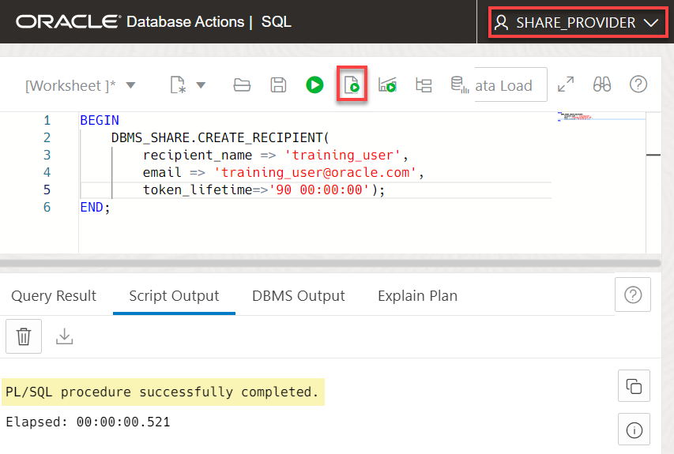
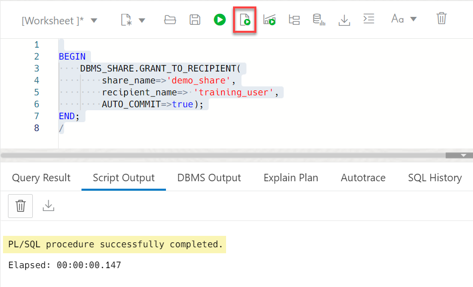
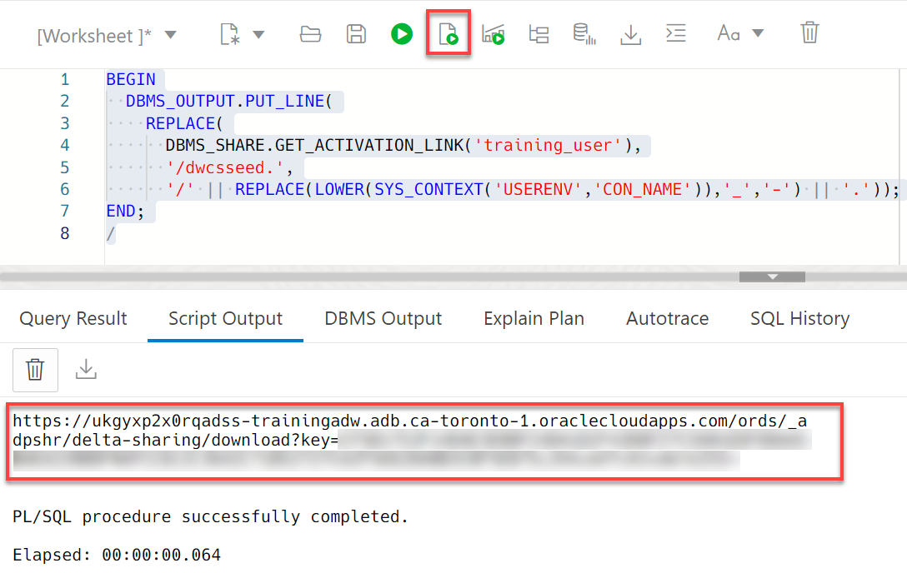
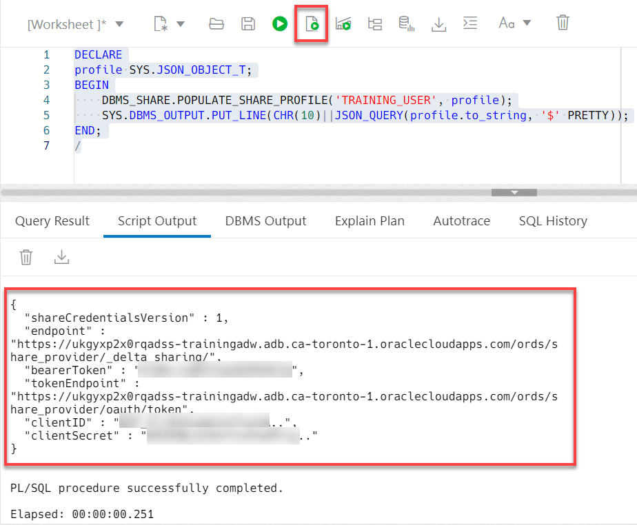

# Create and Authorize the Data Share Recipient

## Introduction

A recipient is the user who will consume the data contained in the data share. This is part of the security functionality. The recipient's email is required because the activation link will be sent to the the user's specified email address.

In this lab, you will create and authorize a new recipient that will access the data share. You will then provide the new recipient with the activation link.

Estimated Time: 20 minutes

### Objectives

In this lab, you will:

* Create a new share recipient.

### Prerequisites

This lab assumes that you have successfully completed all of the preceding labs in the **Contents** menu on the left.

## Task 1: Navigate to the SQL Worksheet

1. If you still have your SQL Worksheet open, skip over to step **Task: 2**; otherwise, to navigate to the SQL Worksheet, log in to the **Oracle Cloud Console**, if you are not already logged as the Cloud Administrator. You will complete all the labs in this workshop using this Cloud Administrator. On the **Sign In** page, select your tenancy, enter your username and password, and then click **Sign In**. The **Oracle Cloud Console** Home page is displayed.

2. Open the **Navigation** menu and click **Oracle Database**. Under **Oracle Database**, click **Autonomous Database**.

3. On the **Autonomous Databases** page, click your **ADW-Data-Lake** ADB instance.

4. On the **Autonomous Database details** page, click **Database actions**.

5. A **Launch DB actions** message box with the message **Please wait. Initializing DB Actions** is displayed. Next, the **Database Actions | Launchpad** Home page is displayed in a _**new tab in your browser**_. In the **Data Studio** section, click the **SQL** card to display the SQL Worksheet.

## Task 2: Create a Recipient

1. Create a new recipient. Copy and paste the following script into your SQL Worksheet, and then click the **Run Script** icon in the Worksheet toolbar.

    ```
    <copy>
    BEGIN
        DBMS_SHARE.CREATE_RECIPIENT(
            recipient_name => 'live_lab_user',
            email => 'live_lab_user@oracle.com');
    END;
    </copy>
    ```

    

2. Query the available recipients. Copy and paste the following script into your SQL Worksheet, and then click the **Run Statement** icon in the Worksheet toolbar.

    ```
    <copy>
    SELECT recipient_name, updated
    FROM user_share_recipients;
    </copy>
    ```

    

## Task 3: Grant the Recipient Access Privileges to the Share

1. Grant the new recipient access to the share. Copy and paste the following script into your SQL Worksheet, and then click the **Run Script** icon in the Worksheet toolbar.

    ```
    <copy>
    BEGIN
        DBMS_SHARE.GRANT_TO_RECIPIENT(
            share_name=>'demo_share',
            recipient_name=> 'live_lab_user',
            AUTO_COMMIT=>true);
    END;
    /
    </copy>
    ```

    

2. Check the access privileges for the recipient. Copy and paste the following script into your SQL Worksheet, and then click the **Run Script** icon in the Worksheet toolbar.

    ```
    <copy>
    SELECT recipient_name, share_name
    FROM user_share_recipient_grants
    WHERE recipient_name = 'LIVE_LAB_USER';
    </copy>
    ```

    

## Task 4: Generate the Activation Link

There are two type of APIs to create the Delta share profile. 

### **Method 1**

Use an API that generates the activation link's URL which the recipient can use to download a `JSON` config file. Copy and paste the following script into your SQL Worksheet, and then click the **Run Script** icon in the Worksheet toolbar.

```
<copy>
BEGIN
    DBMS_OUTPUT.PUT_LINE(dbms_share.get_activation_link
        (recipient_name=>'LIVE_LAB_USER'));
END;
/
</copy>
```


### **Method 2**

The second method directly generates the `JSON` config file which you can share with recipient using any method you desire.

1. Generate the Delta Share `JSON` config file. Copy and paste the following script into your SQL Worksheet, and then click the **Run Script** icon in the Worksheet toolbar.

    ```
    <copy>
    DECLARE
    profile SYS.JSON_OBJECT_T;
    BEGIN
        DBMS_SHARE.POPULATE_SHARE_PROFILE('LIVE_LAB_USER', profile);
        SYS.DBMS_OUTPUT.PUT_LINE(CHR(10)||JSON_QUERY(profile.to_string, '$' PRETTY));
    END;
    /
    </copy>
    ```

    

    The procedure **`DBMS_SHARE.POPULATE_SHARE_PROFILE`** returns a `JSON` config file similar to the following format:

    


## Learn More

* [Oracle Cloud Infrastructure Documentation](https://docs.cloud.oracle.com/en-us/iaas/Content/GSG/Concepts/baremetalintro.htm)
* [Using Oracle Autonomous Database Serverless](https://docs.oracle.com/en/cloud/paas/autonomous-database/adbsa/index.html)

## Acknowledgements

* **Author:** Lauran K. Serhal, Consulting User Assistance Developer
* **Contributor:** Alexey Filanovskiy, Senior Principal Product Manager
* **Last Updated By/Date:** Lauran K. Serhal, July 2023

Data about movies in this workshop were sourced from Wikipedia.

Copyright (C) Oracle Corporation.

Permission is granted to copy, distribute and/or modify this document
under the terms of the GNU Free Documentation License, Version 1.3
or any later version published by the Free Software Foundation;
with no Invariant Sections, no Front-Cover Texts, and no Back-Cover Texts.
A copy of the license is included in the section entitled [GNU Free Documentation License](files/gnu-free-documentation-license.txt)