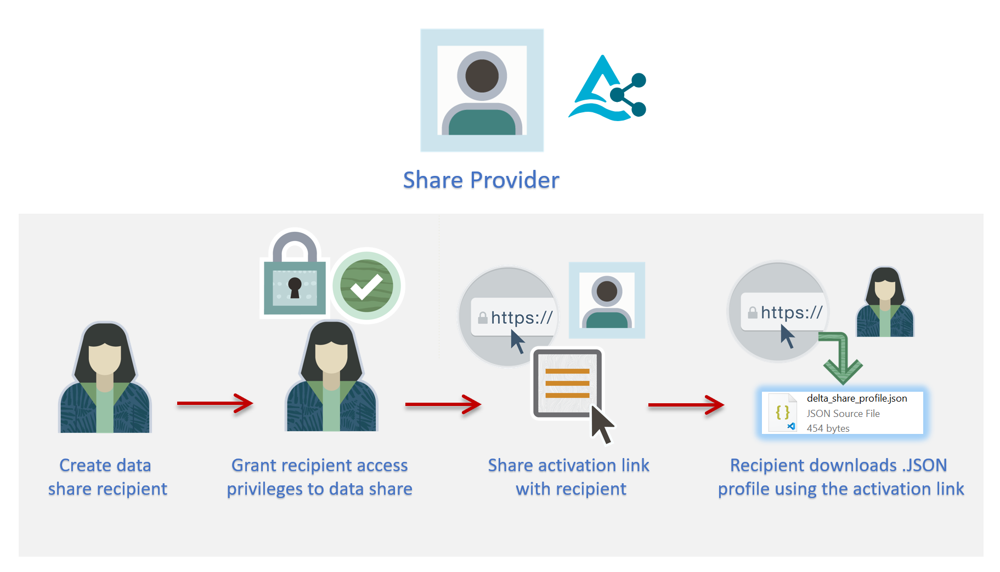
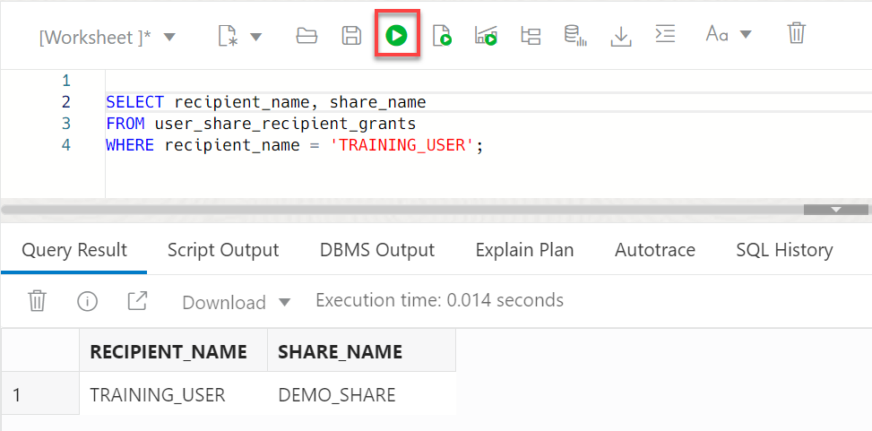
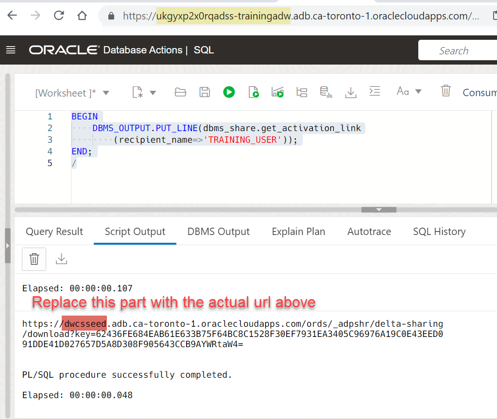
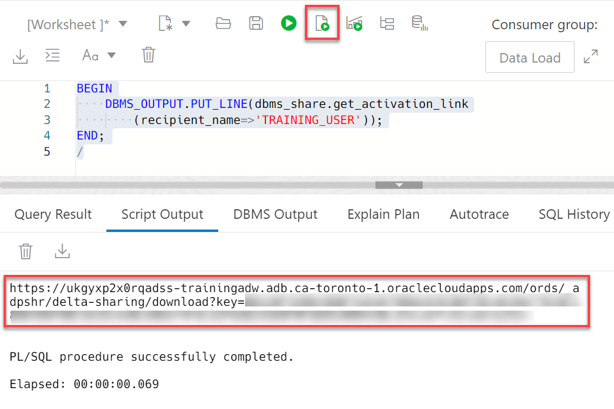
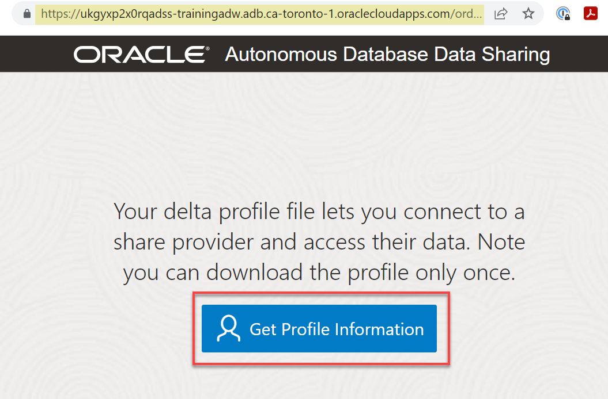
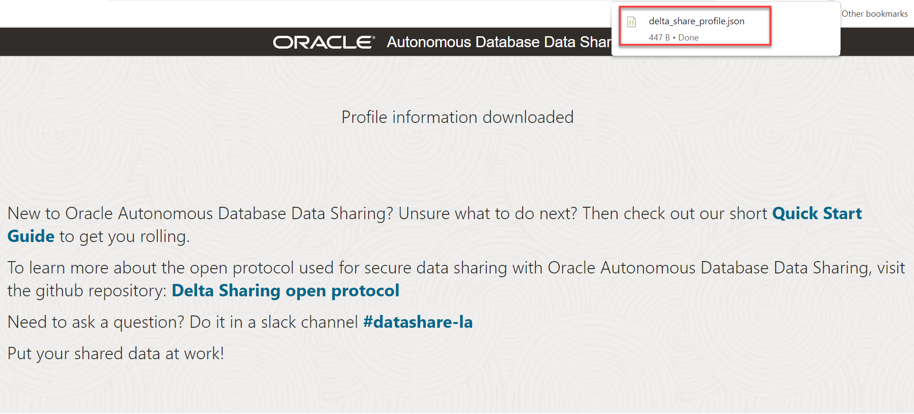

# Create and Authorize the Data Share Recipient

## Introduction

A data share recipient is an entity such as an individual, an institution, or a software system that receives a data share from a data share provider.A recipient can access the data in the share. A recipient can have access to multiple shares. If you remove a recipient, that recipient loses access to all shares it could previously access.

In this lab, as a data share provider, you will create and authorize a new recipient that will access the data share and the `custsales` table in the share. You will then provide the new recipient with the activation link to access the data share.



Estimated Time: 20 minutes

### Objectives

In this lab, you will:

* Create a new share recipient.

### Prerequisites

This lab assumes that you have successfully completed all of the preceding labs in the **Contents** menu on the left.

## Task 1: Create a Data Share Recipient

1. Create a new data share recipient user named `training_user`. Copy and paste the following script into your SQL Worksheet, and then click the **Run Script** icon.

    ```
    <copy>
    BEGIN
        DBMS_SHARE.CREATE_RECIPIENT(
            recipient_name => 'training_user',
            email => 'training_user@oracle.com');
    END;
    </copy>
    ```

    

2. Query the available recipients. Copy and paste the following script into your SQL Worksheet, and then click the **Run Statement** icon.

    ```
    <copy>
    SELECT recipient_name, updated
    FROM user_share_recipients;
    </copy>
    ```

    

## Task 2: Grant the Recipient Access Privileges to the Data Share

1. Grant the new `training_user` recipient access to the `demo_share` data share. Copy and paste the following script into your SQL Worksheet, and then click the **Run Script** icon.

    ```
    <copy>
    BEGIN
        DBMS_SHARE.GRANT_TO_RECIPIENT(
            share_name=>'demo_share',
            recipient_name=> 'training_user',
            AUTO_COMMIT=>true);
    END;
    /
    </copy>
    ```

    

2. Check the data shares access privileges for the `training_user` recipient. Copy and paste the following script into your SQL Worksheet, and then click the **Run Script** icon.

    ```
    <copy>
    SELECT recipient_name, share_name
    FROM user_share_recipient_grants
    WHERE recipient_name = 'TRAINING_USER';
    </copy>
    ```

    

    The `training_user` recipient has only access privileges to the `demo_share` data share.

## Task 3: Generate the Activation Link and Get Profile Information

As the share provider user (`admin`), you need to provide the `training_user` recipient user with the activation link needed to download the configuration file; alternatively, you can pass along the actual configuration file itself that the user will use to create access credential in the next lab. There are two methods that you can use to provide the recipient with the configuration file:

### **Method 1**

_**Note to Reviewers:** The following generated activation link is not yet working as I would get a Page not found error when I use it in a browser tab. The issue is that the generated URL contains the wrong string at the beginning. The fix is to simply replace the highlighted part of the generated url with the highlighted part in the address bar_



1. As the share provider admin user, generate the activation link's URL which you can forward to the recipient. Copy and paste the following script into your SQL Worksheet, and then click the **Run Script** icon.

    ```
    <copy>
    BEGIN
        DBMS_OUTPUT.PUT_LINE(dbms_share.get_activation_link
            (recipient_name=>'TRAINING_USER'));
    END;
    /
    </copy>
    ```

    

2. Copy the generated URL to a text editor of your choice. Replace the beginning of the URL after the `https://` with the URL part that you see in your browser's address bar. In our example, we will replace the **`dwcsseed`** string with the following from the URL in our browser: **`ukgyxp2x0rqadss-trainingadw`**.  Share this edited URL with the recipient user.

    

3. The recipient user can use this URL to download the `JSON` config file (delta profile) which contains the required credentials he or she needs to connect to the data share and access its tables. Press **[Enter]**. The **Autonomous Database Data Sharing** page is displayed. To download the config file, click **Get Profile Information**.

    

    >**Note:** You can download this profile file only once; therefore, make sure you save it once it's downloaded.

    The **Profile information downloaded** page is displayed and the downloaded file is displayed in a popup window.

    

4. The **`delta_share_profile`.json** file is downloaded to your browser's download directory. Open the file.

    

    The file content is displayed. You will need this information in the next lab to connect and use the data share.

    

### **Method 2**

**_Note to Reviewers:** The following code generated an error for me but Alexey was able to run it on his machine. It might be an issue with the adwc4pm tenancy not containing the latest code. With this method, the config file content is displayed in the **Script output** tab. As a share provider admin user, you would share this config file with your recipient via email, slack, and so on._

The second method directly generates the `JSON` config file which you can share with recipient using any method you desire.

1. Generate the Delta Share `JSON` config file. Copy and paste the following script into your SQL Worksheet, and then click the **Run Script** icon.

    ```
    <copy>
    DECLARE
    profile SYS.JSON_OBJECT_T;
    BEGIN
        DBMS_SHARE.POPULATE_SHARE_PROFILE('TRAINING_USER', profile);
        SYS.DBMS_OUTPUT.PUT_LINE(CHR(10)||JSON_QUERY(profile.to_string, '$' PRETTY));
    END;
    /
    </copy>
    ```

    The profile information is displayed in the **Script Output** tab. Save the profile information on your machine as you'll need to share it with the recipient.

    The procedure **`DBMS_SHARE.POPULATE_SHARE_PROFILE`** returns a `JSON` config file similar to the following format:

    

    As the recipient user, you will need all of the values in this file in the next lab to create the required credential to access your authorized data share.

You may now proceed to the next lab.

## Learn More

* [Oracle Cloud Infrastructure Documentation](https://docs.cloud.oracle.com/en-us/iaas/Content/GSG/Concepts/baremetalintro.htm)
* [Using Oracle Autonomous Database Serverless](https://docs.oracle.com/en/cloud/paas/autonomous-database/adbsa/index.html)

## Acknowledgements

* **Author:** Lauran K. Serhal, Consulting User Assistance Developer
* **Contributor:** Alexey Filanovskiy, Senior Principal Product Manager
* **Last Updated By/Date:** Lauran K. Serhal, July 2023

Data about movies in this workshop were sourced from Wikipedia.

Copyright (C) Oracle Corporation.

Permission is granted to copy, distribute and/or modify this document
under the terms of the GNU Free Documentation License, Version 1.3
or any later version published by the Free Software Foundation;
with no Invariant Sections, no Front-Cover Texts, and no Back-Cover Texts.
A copy of the license is included in the section entitled [GNU Free Documentation License](files/gnu-free-documentation-license.txt)