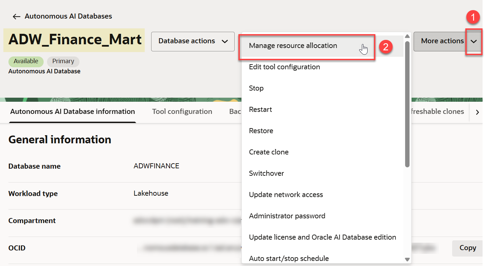

# Scale Your Autonomous Database

_**Important:** This lab uses features which are not available on Oracle's Always Free databases or on the Oracle LiveLabs Sandbox hosted environments (the Green button). If you run this lab using an Always Free database or a LiveLabs Sandbox environment, you can only review the steps and later practice the steps using your organization’s own tenancy._

## Introduction

In this lab, you will scale up your Oracle Autonomous Data Warehouse (ADW) or Autonomous Transaction Processing (ATP) service to have more CPUs. You will also watch a demo that shows the performance and concurrency impacts of scaling your service online.

Estimated Time: 10 minutes

Watch the video below for a quick walk-through of the lab.

[Scale Your Autonomous Database](videohub:1_ls8fjm2p)

### Objectives

-   Learn how to scale up an ADW or ATP service
-   Understand the performance and concurrency impacts of scaling your autonomous database service online

## Task 1: Scaling your Autonomous Database Instance

1. Go back to the Cloud Console you used during the provisioning exercise and go to the database instance's **Autonomous Database details** page. Click the **Manage resource allocation** button.

    

2. Specify the following in the **Manage resource allocation** panel.

    - **ECPU count:** 16
    - **Compute auto scaling:** The provisioning lab instructed you to accept the default enablement of auto scaling. Keep the checkmark in this checkbox.
    - **Storage (TB):** 2
    - **Storage auto scaling:** Keep this checkbox deselected; by default the checkbox does not have a checkmark.

    > **Note:** You can scale up/down your autonomous database only if your autonomous database is NOT Always Free.

3. Click **Apply**.

    

    >**Note:** Applications can continue running during the scale operation without downtime.

4. The **Autonomous Database details** page is re-displayed. The instance status is **SCALING IN PROGRESS**. Wait a few minutes for the scaling to finish.

    

5. When scaling finishes, the instance status changes to **AVAILABLE**. You may need to refresh the page to see the result of the scale operation.

   

## Task 2: Performance and Concurrency Benefits of Dynamic Scaling

1.  Watch a demo of the performance impact of scaling up your instance. It shows how you can dynamically scale up a database while the workload is running, to increase transaction throughput. Scaling up can also provide more concurrency for your users.

    

2.  In this example, scaling up the number of CPUs from 2 to 8 increased the transaction throughput from 2000 to 7500 transactions per second.

    

You may now **proceed to the next lab**.

## Want to Learn More?

* [Add CPU or Storage Resources or Enable Auto Scaling](https://docs.oracle.com/en/cloud/paas/autonomous-data-warehouse-cloud/user/autonomous-add-resources.html#GUID-DA72422A-5A70-42FA-A363-AB269600D4B0)
## **Acknowledgements**

* **Authors:**
    * Lauran K. Serhal, Consulting User Assistance Developer
    * Nilay Panchal, ADB Product Management
* **Contributor:** Richard Green, Principal Developer, Database User Assistance
- **Last Updated By/Date:** Lauran K. Serhal, May 2024
