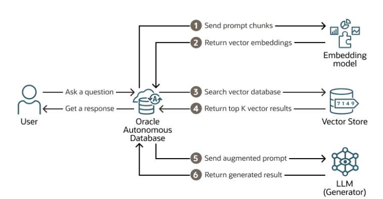
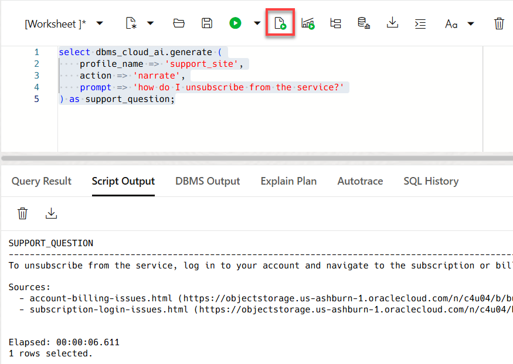
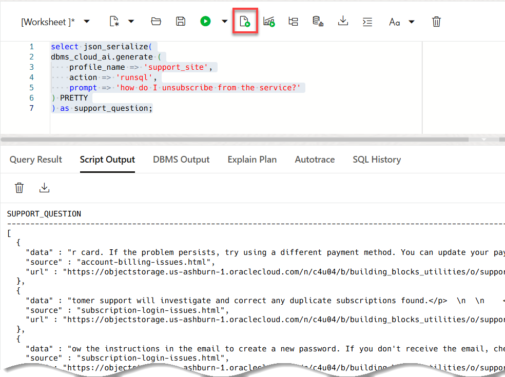
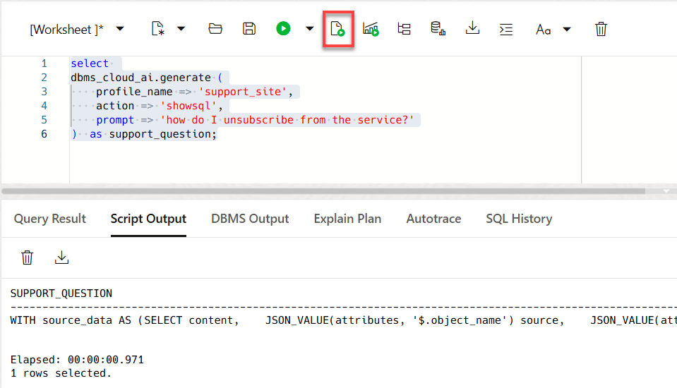

# Ask Questions Using Select AI APIs

## Introduction

In this lab, you will ask support questions that can be answered by information contained in the support site. You can use natural language to interact with your database and LLMs through SQL to enhance user productivity and develop AI-based applications. Select AI simplifies and automates using generative AI, whether generating, running, and explaining SQL from a natural language prompt, using retrieval augmented generation with vector stores, generating synthetic data, or chatting with the LLM. When you use Select AI, Autonomous Database manages the process of converting natural language into SQL. This means you can provide a natural language prompt instead of SQL code to interact with your data. Select AI serves as a productivity tool for SQL users and developers and enables non-expert SQL users to derive useful insights from their data, without having to understand data structures or technical languages.

Estimated Time: 3 minutes.

### Objectives

In this lab, you will:

* Run Select AI queries using various actions

### Prerequisites

* This lab requires the completion of the previous labs that deployed your Autonomous Database.

## Task 1: Overview of Select AI

Select AI provides the **`dbms_cloud_ai.generate`** built-in function that you will use to generate different kinds of responses from natural language queries.

Here are the available actions:

* **chat:** Use for general AI chat.
* **runsql:** Use to ask a question and get a structured result.
* **narrate:** Use to ask a question and get a conversational result.
* **showsql:** Use to show the SQL code that was used to produce the result.

Select AI implements RAG as shown in the following diagram and explanation:



* You as the user asked a question (specified a prompt) using the Select AI  narrate action.
* Select AI generated Vector embeddings of the prompt using the embedding model specified in the AI profile (we used the default in our example).
* The vector search index used the Vector embedding of the question to find matching content from the moviestream enterprise data (searching the Vector store) which has been indexed.
* The Vector search returns top n texts _similar_ to the input to your Autonomous Database instance.
* Autonomous Database then sent these top `n` query results with the user question to the LLM.
* The LLM returned its response to your Autonomous Database instance.
* Autonomous Database Select AI provides the response to the user. You can control the `n` value as an attribute
So, the response grabbed n chunks and sent them to the model.

## Task 2: Ask Questions Using Various Select AI Actions

Let's look at some examples of using Select AI with the available actions.

1. Use the **narrate** action to get a conversational response. Copy the following code and then paste it into your SQL Worksheet. Next, click the **Run Script** icon in the toolbar.

    ```sql
    <copy>
    select dbms_cloud_ai.generate (
        profile_name => 'support_site',
        action => 'narrate',
        prompt => 'how do I unsubscribe from the service?'
    ) as support_question;
    </copy>
    ```

    

    The result also reference the two available support Web site sources:

    * [account-billing-issues.html](https://objectstorage.us-ashburn-1.oraclecloud.com/n/c4u04/b/building_blocks_utilities/o/support-site/account-billing-issues.html)
    * [subscription-login-issues.html](https://objectstorage.us-ashburn-1.oraclecloud.com/n/c4u04/b/building_blocks_utilities/o/support-site/subscription-login-issues.html) 

2. Use the **runsql** action to see each of the chunks and their similarity (or distance) score. Copy the following code and then paste it into your SQL Worksheet. Next, click the **Run Statement** icon in the toolbar.

    ```
    <copy>
    select json_serialize(
    dbms_cloud_ai.generate (
        profile_name => 'support_site',
        action => 'runsql',
        prompt => 'how do I unsubscribe from the service?'
    ) PRETTY
    ) as support_question;
    </copy>
    ```

    

3. Use the **showsql** action to see the SQL command that was used to run the vector search. Copy the following code and then paste it into your SQL Worksheet. Next, click the **Run Statement** icon in the toolbar.

    ```
    <copy>
    select 
    dbms_cloud_ai.generate (
        profile_name => 'support_site',
        action => 'showsql',
        prompt => 'how do I unsubscribe from the service?'
    )  as support_question;
    </copy>
    ```

    

You may now proceed to the next lab.

## Learn More
* [DBMS\_NETWORK\_ACL\_ADMIN PL/SQL Package](https://docs.oracle.com/en/database/oracle/oracle-database/19/arpls/DBMS_NETWORK_ACL_ADMIN.html#GUID-254AE700-B355-4EBC-84B2-8EE32011E692)
* [DBMS\_CLOUD\_AI Package](https://docs.oracle.com/en-us/iaas/autonomous-database-serverless/doc/dbms-cloud-ai-package.html)
* [Using Oracle Autonomous Database Serverless](https://docs.oracle.com/en/cloud/paas/autonomous-database/adbsa/index.html)
* [Overview of Generative AI Service](https://docs.oracle.com/en-us/iaas/Content/generative-ai/overview.htm)

## Acknowledgements

  * **Authors:**
    * Marty Gubar, Product Management
    * Lauran K. Serhal, Consulting User Assistance Developer
  * **Last Updated By/Date:** Lauran K. Serhal, February 2025

Data about movies in this workshop were sourced from **Wikipedia**.

Copyright (c) 2025 Oracle Corporation.

Permission is granted to copy, distribute and/or modify this document
under the terms of the GNU Free Documentation License, Version 1.3
or any later version published by the Free Software Foundation;
with no Invariant Sections, no Front-Cover Texts, and no Back-Cover Texts.
A copy of the license is included in the section entitled [GNU Free Documentation License](https://oracle-livelabs.github.io/adb/shared/adb-15-minutes/introduction/files/gnu-free-documentation-license.txt)